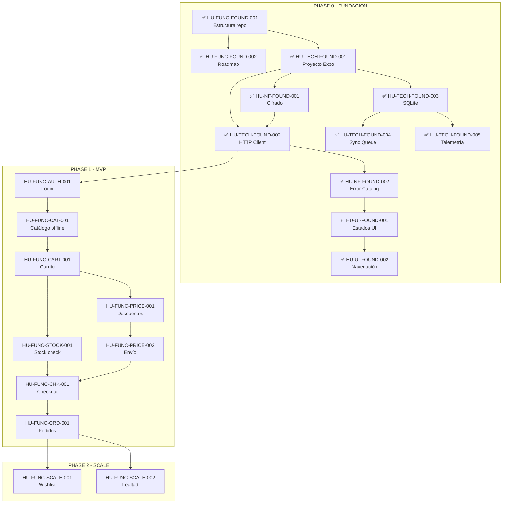

# Backlog de Historias de Usuario

## App Mobile WooCommerce

---

## Resumen por Fase y Tipo

| Fase | FUNCIONAL | TECNICA | NO_FUNCIONAL | UI_UX | Total |
|------|-----------|---------|--------------|-------|-------|
| PHASE_0_FUNDACION | 2 | 5 | 2 | 2 | **11** |
| PHASE_1_MVP | 8 | 8 | 4 | 7 | **27** |
| PHASE_2_SCALE | 2 | 1 | 1 | 1 | **5** |
| **Total** | **12** | **14** | **7** | **10** | **43** |

## Estado General

| Estado | Cantidad |
|--------|----------|
| FINALIZADA | 11 |
| PENDIENTE | 32 |
| **Total** | **43** |

---

## PHASE_0_FUNDACION (11 HUs)

| ID | Título | Tipo | Prioridad | Estado | Dependencias |
|----|--------|------|-----------|--------|--------------|
| HU-FUNC-FOUND-001 | Estructura oficial del repositorio y carpetas | FUNCIONAL | P0 | FINALIZADA | Ninguna |
| HU-FUNC-FOUND-002 | Roadmap por fases publicado en planning | FUNCIONAL | P0 | FINALIZADA | HU-FUNC-FOUND-001 |
| HU-TECH-FOUND-001 | Proyecto base Expo (React Native) listo para escalar | TECNICA | P0 | FINALIZADA | HU-FUNC-FOUND-001 |
| HU-TECH-FOUND-002 | Cliente HTTP base + normalización de errores | TECNICA | P0 | FINALIZADA | HU-TECH-FOUND-001, HU-NF-FOUND-001 |
| HU-TECH-FOUND-003 | SQLite base + repositorios (offline-first) | TECNICA | P0 | FINALIZADA | HU-TECH-FOUND-001 |
| HU-TECH-FOUND-004 | Sync Queue base (job runner local) | TECNICA | P0 | FINALIZADA | HU-TECH-FOUND-001, HU-TECH-FOUND-003 |
| HU-TECH-FOUND-005 | Telemetría base + correlación por session_id | TECNICA | P0 | FINALIZADA | HU-TECH-FOUND-001, HU-TECH-FOUND-003 |
| HU-NF-FOUND-001 | Cifrado de datos sensibles en storage | NO_FUNCIONAL | P0 | FINALIZADA | HU-TECH-FOUND-001 |
| HU-NF-FOUND-002 | Catálogo de errores estándar (UX-friendly) | NO_FUNCIONAL | P0 | FINALIZADA | HU-FUNC-FOUND-001, HU-TECH-FOUND-002 |
| HU-UI-FOUND-001 | Estados globales UI (loading/error/offline) consistentes | UI_UX | P0 | FINALIZADA | HU-TECH-FOUND-001, HU-NF-FOUND-002 |
| HU-UI-FOUND-002 | Base de navegación y layout (safe areas, estructura MVP) | UI_UX | P0 | FINALIZADA | HU-TECH-FOUND-001, HU-UI-FOUND-001 |

---

## PHASE_1_MVP (27 HUs)

### Autenticación

| ID | Título | Tipo | Prioridad | Estado | Dependencias |
|----|--------|------|-----------|--------|--------------|
| HU-FUNC-AUTH-001 | Login obligatorio para acceder a la app | FUNCIONAL | P0 | PENDIENTE | HU-TECH-FOUND-001, HU-TECH-FOUND-002, HU-NF-FOUND-001 |
| HU-TECH-AUTH-001 | Persistencia segura de sesión (token + user_id) | TECNICA | P0 | PENDIENTE | HU-TECH-FOUND-001, HU-NF-FOUND-001 |
| HU-UI-AUTH-001 | Pantalla Login rápida, simple y confiable | UI_UX | P0 | PENDIENTE | HU-FUNC-AUTH-001, HU-UI-FOUND-001 |

### Catálogo

| ID | Título | Tipo | Prioridad | Estado | Dependencias |
|----|--------|------|-----------|--------|--------------|
| HU-FUNC-CAT-001 | Navegar catálogo y categorías offline (modo lectura) | FUNCIONAL | P0 | PENDIENTE | HU-FUNC-AUTH-001, HU-TECH-FOUND-003, HU-TECH-CAT-001 |
| HU-TECH-CAT-001 | Sincronización incremental de catálogo (pull) | TECNICA | P0 | PENDIENTE | HU-TECH-FOUND-002, HU-TECH-FOUND-003 |
| HU-NF-CAT-001 | Performance catálogo en gama media | NO_FUNCIONAL | P0 | PENDIENTE | HU-FUNC-CAT-001, HU-TECH-CAT-001 |
| HU-UI-CAT-001 | Cards de producto con jerarquía clara | UI_UX | P0 | PENDIENTE | HU-FUNC-CAT-001, HU-UI-FOUND-001 |

### Carrito

| ID | Título | Tipo | Prioridad | Estado | Dependencias |
|----|--------|------|-----------|--------|--------------|
| HU-FUNC-CART-001 | Agregar, ajustar y eliminar productos del carrito local | FUNCIONAL | P0 | PENDIENTE | HU-FUNC-CAT-001, HU-TECH-CART-001 |
| HU-TECH-CART-001 | Persistencia de carrito + price_snapshot | TECNICA | P0 | PENDIENTE | HU-TECH-FOUND-003, HU-TECH-CAT-001 |
| HU-UI-CART-001 | Carrito con CTA fijo "Ir a pagar" | UI_UX | P0 | PENDIENTE | HU-FUNC-CART-001, HU-UI-FOUND-001 |

### Pricing/Envío

| ID | Título | Tipo | Prioridad | Estado | Dependencias |
|----|--------|------|-----------|--------|--------------|
| HU-FUNC-PRICE-001 | Mostrar descuento por volumen aplicado en checkout | FUNCIONAL | P0 | PENDIENTE | HU-FUNC-CART-001, HU-TECH-PRICE-001 |
| HU-FUNC-PRICE-002 | Calcular y mostrar costo de envío en checkout | FUNCIONAL | P0 | PENDIENTE | HU-FUNC-PRICE-001, HU-TECH-PRICE-001 |
| HU-TECH-PRICE-001 | Servicio de cotización (quote) para totales finales | TECNICA | P0 | PENDIENTE | HU-TECH-FOUND-002, HU-TECH-CART-001 |
| HU-UI-PRICE-001 | Checkout con desglose claro de totales | UI_UX | P0 | PENDIENTE | HU-FUNC-PRICE-001, HU-FUNC-PRICE-002, HU-UI-FOUND-001 |

### Stock

| ID | Título | Tipo | Prioridad | Estado | Dependencias |
|----|--------|------|-----------|--------|--------------|
| HU-FUNC-STOCK-001 | Validar stock antes de permitir finalizar compra (hard stop) | FUNCIONAL | P0 | PENDIENTE | HU-FUNC-CART-001, HU-TECH-STOCK-001 |
| HU-TECH-STOCK-001 | Validación just-in-time con soporte a "reserva por X minutos" | TECNICA | P0 | PENDIENTE | HU-TECH-FOUND-002, HU-TECH-CART-001 |
| HU-UI-STOCK-001 | UI de stock con acciones rápidas | UI_UX | P0 | PENDIENTE | HU-FUNC-STOCK-001, HU-UI-FOUND-001 |

### Checkout

| ID | Título | Tipo | Prioridad | Estado | Dependencias |
|----|--------|------|-----------|--------|--------------|
| HU-FUNC-CHK-001 | Finalizar compra encolando la orden (flujo confiable) | FUNCIONAL | P0 | PENDIENTE | HU-FUNC-STOCK-001, HU-FUNC-PRICE-001, HU-FUNC-PRICE-002, HU-TECH-CHK-001, HU-TECH-FOUND-004 |
| HU-TECH-CHK-001 | Idempotencia (client_order_id) + deduplicación por consulta | TECNICA | P0 | PENDIENTE | HU-TECH-FOUND-004, HU-TECH-STOCK-001, HU-TECH-PRICE-001 |
| HU-NF-CHK-001 | Prevención de doble tap y multi-submit | NO_FUNCIONAL | P0 | PENDIENTE | HU-FUNC-CHK-001, HU-TECH-CHK-001 |
| HU-UI-CHK-001 | UI "Procesando orden" + éxito/error | UI_UX | P0 | PENDIENTE | HU-FUNC-CHK-001, HU-UI-FOUND-001 |

### Pedidos

| ID | Título | Tipo | Prioridad | Estado | Dependencias |
|----|--------|------|-----------|--------|--------------|
| HU-FUNC-ORD-001 | Ver historial y detalle de pedidos (Pendiente/Entregado) | FUNCIONAL | P0 | PENDIENTE | HU-FUNC-CHK-001, HU-TECH-SYNC-001 |
| HU-UI-ORD-001 | Historial simple con 2 estados visibles | UI_UX | P0 | PENDIENTE | HU-FUNC-ORD-001, HU-UI-FOUND-001 |

### Sync / Observabilidad / Seguridad

| ID | Título | Tipo | Prioridad | Estado | Dependencias |
|----|--------|------|-----------|--------|--------------|
| HU-TECH-SYNC-001 | Pull incremental de pedidos | TECNICA | P0 | PENDIENTE | HU-TECH-FOUND-002, HU-TECH-FOUND-003 |
| HU-TECH-OBS-001 | Instrumentación del embudo de conversión | TECNICA | P0 | PENDIENTE | HU-TECH-FOUND-005 |
| HU-NF-OBS-001 | Notificar degradación del sistema padre (Woo/ERP) | NO_FUNCIONAL | P0 | PENDIENTE | HU-TECH-FOUND-002, HU-TECH-OBS-001 |
| HU-NF-SEC-001 | Política de datos sensibles (cifrado + minimización) | NO_FUNCIONAL | P0 | PENDIENTE | HU-NF-FOUND-001, HU-TECH-AUTH-001 |

---

## PHASE_2_SCALE (5 HUs)

| ID | Título | Tipo | Prioridad | Estado | Dependencias |
|----|--------|------|-----------|--------|--------------|
| HU-FUNC-SCALE-001 | Wishlist (favoritos) | FUNCIONAL | P2 | PENDIENTE | Phase 1, HU-TECH-FOUND-003, HU-FUNC-CAT-001 |
| HU-FUNC-SCALE-002 | Programa de lealtad | FUNCIONAL | P2 | PENDIENTE | Phase 1, HU-FUNC-AUTH-001 |
| HU-TECH-SCALE-001 | Preparar base para notificaciones futuras | TECNICA | P2 | PENDIENTE | Phase 1, HU-TECH-FOUND-001 |
| HU-NF-SCALE-001 | Hardening de performance (catálogo + imágenes) | NO_FUNCIONAL | P1 | PENDIENTE | HU-NF-CAT-001, Phase 1 |
| HU-UI-SCALE-001 | UX post-compra mejorada (recompra rápida) | UI_UX | P2 | PENDIENTE | Phase 1, HU-FUNC-SCALE-001, HU-FUNC-SCALE-002 |

---

## Mapa de Dependencias

---

> **Regla**: Este archivo debe actualizarse cada vez que una HU cambie de estado.
> Última actualización: 2026-03-01
