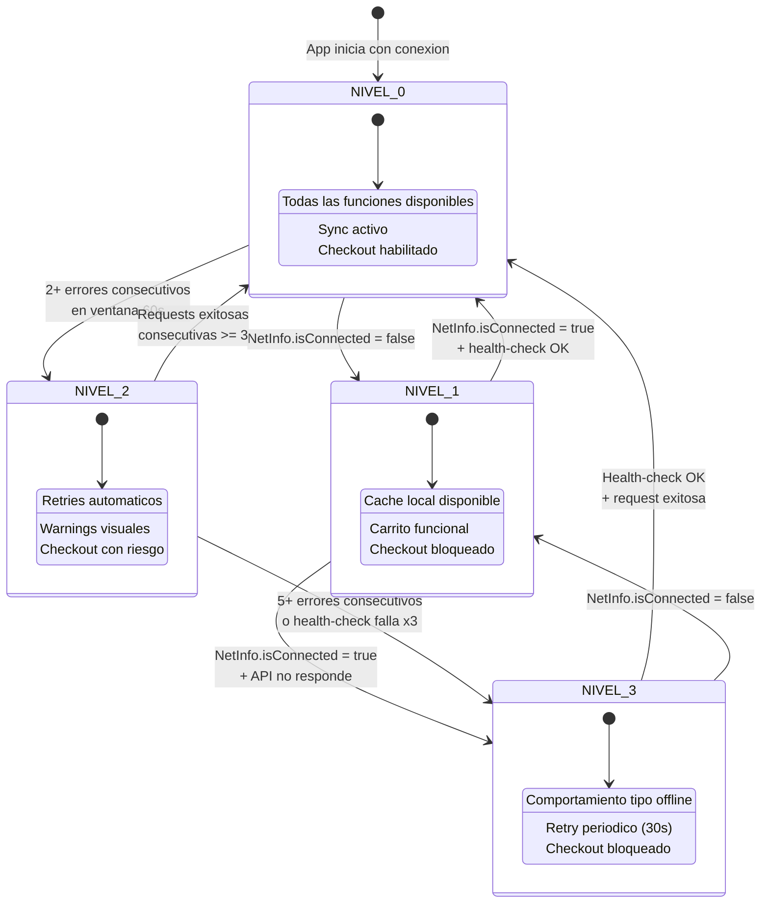

# Estrategia de Degradacion del Sistema

## Descripcion General

La app WooCommerce Mobile sigue un modelo **offline-first** para catalogo y carrito, pero requiere conexion para checkout. Este documento define como la app se comporta cuando las condiciones de red o del servidor se degradan, asegurando que el usuario siempre tenga la mejor experiencia posible dado el contexto.

La estrategia se basa en **4 niveles de degradacion** progresivos, con comportamientos especificos por pantalla, indicadores visuales claros y mecanismos de recuperacion automatica.

---

## 1. Niveles de Degradacion

| Nivel | Nombre | Condicion | Deteccion | Descripcion |
|---|---|---|---|---|
| **NIVEL 0** | Todo funcional | `NetInfo.isConnected === true` + API responde 2xx | Estado por defecto | Todas las funcionalidades disponibles. Sync en tiempo real. Checkout habilitado. |
| **NIVEL 1** | Sin conexion | `NetInfo.isConnected === false` | Listener `NetInfo.addEventListener` | Modo offline. Catalogo desde cache SQLite. Carrito funcional. Checkout bloqueado. Sync suspendido. |
| **NIVEL 2** | API degradada | Conexion activa + respuestas intermitentes (timeouts, 5xx parciales) | Contador de errores consecutivos >= 2 en ventana de 60s | Retries automaticos con backoff. Warnings visuales. Checkout permitido pero con riesgo de fallo. |
| **NIVEL 3** | API caida total | Conexion activa + todas las requests fallan (5xx o timeout consistente) | Contador de errores consecutivos >= 5 o health-check falla 3 veces | Similar a offline pero con conexion de red. Retry periodico para detectar recuperacion. Checkout bloqueado. |

### Diagrama de Estados de Degradacion



---

## 2. Comportamiento por Pantalla

### Tabla de comportamiento

| Pantalla | NIVEL 0 (Funcional) | NIVEL 1 (Sin conexion) | NIVEL 2 (API degradada) | NIVEL 3 (API caida) |
|---|---|---|---|---|
| **Catalogo** | Datos frescos del servidor. Pull-to-refresh activo. Busqueda online. | Datos desde cache SQLite. Pull-to-refresh deshabilitado. Indicador "Datos offline". | Datos del servidor con retry. Pull-to-refresh con delay. Warning "Conexion inestable". | Datos desde cache SQLite. Pull-to-refresh intenta pero falla. Warning "Servicio no disponible". |
| **Detalle Producto** | Datos actualizados. Stock en tiempo real. Boton "Agregar" activo. | Datos de cache. Stock puede estar desactualizado (nota visible). Boton "Agregar" activo. | Datos con posible delay. Stock puede no estar actualizado. Boton "Agregar" activo. | Datos de cache. Nota "Stock sin verificar". Boton "Agregar" activo. |
| **Carrito** | Items con precios actuales. Boton "Realizar Pedido" activo. Totales calculados. | Items con `priceSnapshot`. Boton "Realizar Pedido" deshabilitado + nota offline. Totales locales. | Items con precios de snapshot. Boton "Realizar Pedido" activo con warning. Totales locales. | Items con `priceSnapshot`. Boton "Realizar Pedido" deshabilitado. Nota "Servicio no disponible". |
| **Checkout** | Flujo completo disponible. Confirmacion en tiempo real. | **BLOQUEADO**. Redirigir a carrito con mensaje offline. | Flujo disponible. Retries automaticos en caso de fallo. Warning visible. | **BLOQUEADO**. Redirigir a carrito con mensaje de servicio caido. |
| **Mis Pedidos** | Lista actualizada del servidor. Detalle en tiempo real. | Lista desde cache local (pedidos previamente sincronizados). Sin actualizaciones. | Lista del servidor con retry. Puede mostrar datos parciales. | Lista desde cache local. Nota "Ultima actualizacion: [fecha]". |

### Detalle por funcionalidad

#### Catalogo

- **NIVEL 0**: `GET /products?modified_after={last_sync_at}` en cada apertura (debounce 30s). Ver [reconciliacion.md](./reconciliacion.md).
- **NIVEL 1**: `SELECT * FROM products` directamente de SQLite. Sin llamadas de red.
- **NIVEL 2**: Intenta fetch con retry (max 2 intentos, timeout reducido a 5s). Si falla, usa cache.
- **NIVEL 3**: Usa cache SQLite. Health-check periodico para detectar recuperacion.

#### Carrito

- **Todos los niveles**: El carrito opera sobre SQLite local (`cart_items`). No depende de la red.
- **Diferencia clave**: El boton "Realizar Pedido" se habilita/deshabilita segun el nivel de degradacion.

#### Checkout

- **NIVEL 0**: Flujo completo. Ver [flujo-checkout.md](./flujo-checkout.md).
- **NIVEL 1**: Bloqueado. Mensaje: "Se requiere conexion a internet para realizar el pedido".
- **NIVEL 2**: Permitido con advertencia. Si falla, el sistema de retries maneja la recuperacion.
- **NIVEL 3**: Bloqueado. Mensaje: "El servicio no esta disponible en este momento. Intenta mas tarde".

---

## 3. Indicadores Visuales

### Componentes por nivel

| Nivel | Componente | Ubicacion | Comportamiento |
|---|---|---|---|
| **NIVEL 0** | Ninguno | N/A | Sin indicadores de degradacion |
| **NIVEL 1** | `OfflineBanner` | Top de la pantalla (persistente) | Banner amarillo: "Sin conexion a internet. Algunos datos pueden no estar actualizados." |
| **NIVEL 1** | Boton checkout deshabilitado | Pantalla carrito | Boton gris con icono de candado. Tooltip: "Requiere conexion". |
| **NIVEL 2** | `DegradedBanner` | Top de la pantalla (descartable) | Banner naranja: "Conexion inestable. Algunas operaciones pueden tardar mas." |
| **NIVEL 2** | Toast de retry | Inferior de pantalla | Toast temporal: "Reintentando conexion..." (aparece durante retries) |
| **NIVEL 3** | `ServiceDownBanner` | Top de la pantalla (persistente) | Banner rojo: "Servicio no disponible. Trabajando para restaurar el servicio." |
| **NIVEL 3** | Boton checkout deshabilitado | Pantalla carrito | Boton gris: "Servicio no disponible". |

### Indicadores adicionales

| Indicador | Descripcion | Niveles |
|---|---|---|
| Timestamp de cache | "Datos de: [fecha/hora]" bajo el titulo de la pantalla | NIVEL 1, NIVEL 3 |
| Badge de sync pendiente | Icono con numero de jobs pendientes en sync_queue | NIVEL 1, NIVEL 2, NIVEL 3 |
| Spinner de reconexion | Spinner pequeno junto al banner indicando intento de reconexion | NIVEL 2, NIVEL 3 |
| Icono de estado en header | Icono de wifi/nube en la barra de navegacion | Todos |

### Iconografia del header

| Nivel | Icono | Color |
|---|---|---|
| NIVEL 0 | Nube con check | Verde (#22c55e) |
| NIVEL 1 | Wifi tachado | Gris (#9ca3af) |
| NIVEL 2 | Nube con signo de exclamacion | Naranja (#f59e0b) |
| NIVEL 3 | Nube con X | Rojo (#ef4444) |

---

## 4. Estrategia de Recovery

### Deteccion de mejora

La app detecta la mejora de las condiciones de red mediante tres mecanismos:

#### 4.1 Listener de NetInfo

```typescript
// Se registra al iniciar la app
NetInfo.addEventListener((state) => {
  if (state.isConnected && previousState === NIVEL_1) {
    // Transicion potencial: NIVEL_1 -> NIVEL_0
    performHealthCheck();
  }
});
```

- Detecta cambios de conectividad en tiempo real.
- Al reconectar, dispara un health-check antes de cambiar de nivel.

#### 4.2 Health-check periodico

- **Endpoint**: `GET /wp-json/wc/v3/system_status` (o endpoint ligero equivalente).
- **Frecuencia por nivel**:
  - NIVEL 0: No aplica (ya funcional).
  - NIVEL 1: Al detectar reconexion via NetInfo.
  - NIVEL 2: Cada 30 segundos.
  - NIVEL 3: Cada 30 segundos.
- **Criterio de exito**: Response 2xx en menos de 5 segundos.

#### 4.3 Request piggyback

- Cualquier request exitosa de la app (fetch de productos, envio de orden, etc.) cuenta como evidencia de recuperacion.
- Si se acumulan 3 requests exitosas consecutivas en NIVEL 2, se transiciona a NIVEL 0.

### Acciones de recovery por transicion

| Transicion | Acciones |
|---|---|
| NIVEL 1 -> NIVEL 0 | 1. Ocultar `OfflineBanner`. 2. Disparar sync incremental de productos. 3. Disparar sync de pedidos. 4. Procesar jobs pendientes en `sync_queue`. 5. Habilitar boton checkout. |
| NIVEL 2 -> NIVEL 0 | 1. Ocultar `DegradedBanner`. 2. Procesar jobs pendientes con prioridad. 3. Registrar evento `degradation_resolved`. |
| NIVEL 3 -> NIVEL 0 | 1. Ocultar `ServiceDownBanner`. 2. Disparar sync completo. 3. Procesar jobs pendientes. 4. Habilitar checkout. 5. Registrar evento `service_restored`. |
| NIVEL 3 -> NIVEL 1 | 1. Cambiar banner a `OfflineBanner`. 2. Suspender health-checks (esperar NetInfo). |

### Debounce anti-thundering-herd

Para evitar saturar el servidor cuando multiples dispositivos reconectan simultaneamente:

| Mecanismo | Parametro | Descripcion |
|---|---|---|
| Jitter aleatorio | 0-5 segundos | Delay aleatorio antes del primer request post-reconexion |
| Debounce de NetInfo | 2 segundos | Ignorar cambios rapidos de conectividad (flapping) |
| Rate limiting de sync | Max 1 sync/30s | No disparar sync mas de una vez cada 30 segundos |
| Backoff en retries | 2s, 4s, 8s | Incremento exponencial entre reintentos |

---

## 5. Telemetria de Degradacion

### Eventos por nivel

| Evento | Nivel | Datos | Descripcion |
|---|---|---|---|
| `degradation_entered` | Todos | `{ level, previousLevel, trigger, timestamp }` | Se entra a un nuevo nivel de degradacion |
| `degradation_resolved` | Todos | `{ fromLevel, toLevel, duration_ms, timestamp }` | Se sale de un nivel de degradacion |
| `offline_detected` | NIVEL 1 | `{ timestamp, lastSyncAt }` | Se detecta perdida de conexion |
| `offline_resolved` | NIVEL 1 -> 0 | `{ duration_ms, pendingJobs, timestamp }` | Se recupera conexion |
| `api_degraded` | NIVEL 2 | `{ errorCount, windowDuration, lastError, timestamp }` | API muestra signos de degradacion |
| `api_down` | NIVEL 3 | `{ errorCount, lastSuccessAt, timestamp }` | API caida total detectada |
| `service_restored` | NIVEL 3 -> 0 | `{ downtime_ms, pendingJobs, timestamp }` | Servicio restaurado desde caida total |
| `health_check_result` | NIVEL 2, 3 | `{ success, responseTime_ms, statusCode, timestamp }` | Resultado de health-check periodico |
| `checkout_blocked` | NIVEL 1, 3 | `{ level, timestamp }` | Usuario intento checkout en nivel bloqueado |
| `sync_queue_backed_up` | NIVEL 1, 2, 3 | `{ pendingJobs, oldestJob_age_ms, timestamp }` | Cola de sync acumula jobs pendientes |

### Metricas derivadas

Estas metricas se calculan a partir de los eventos anteriores para monitoreo:

| Metrica | Calculo | Uso |
|---|---|---|
| Tiempo medio offline | Promedio de `duration_ms` en `offline_resolved` | Entender patrones de conectividad de usuarios |
| Frecuencia de degradacion | Conteo de `degradation_entered` por hora | Detectar problemas de infraestructura |
| Tasa de checkout bloqueado | `checkout_blocked / total_checkout_attempts` | Impacto de degradacion en conversiones |
| Tiempo de recuperacion | Promedio de `duration_ms` en `degradation_resolved` | Eficacia de la estrategia de recovery |

---

## 6. Implementacion Tecnica

### Estado global de degradacion

```typescript
// Estado gestionado por el contexto de conectividad
interface DegradationState {
  level: 0 | 1 | 2 | 3;
  previousLevel: 0 | 1 | 2 | 3;
  enteredAt: string;          // ISO 8601
  consecutiveErrors: number;
  lastSuccessAt: string | null;
  lastHealthCheck: string | null;
}
```

### Reglas de transicion (resumen)

| De | A | Condicion |
|---|---|---|
| NIVEL 0 | NIVEL 1 | `NetInfo.isConnected === false` |
| NIVEL 0 | NIVEL 2 | `consecutiveErrors >= 2` en ventana de 60 segundos |
| NIVEL 1 | NIVEL 0 | `NetInfo.isConnected === true` + health-check exitoso |
| NIVEL 1 | NIVEL 3 | `NetInfo.isConnected === true` + API no responde |
| NIVEL 2 | NIVEL 0 | 3 requests exitosas consecutivas |
| NIVEL 2 | NIVEL 3 | `consecutiveErrors >= 5` o health-check falla 3 veces |
| NIVEL 3 | NIVEL 0 | Health-check exitoso + request exitosa |
| NIVEL 3 | NIVEL 1 | `NetInfo.isConnected === false` |

---

> Referenciado por: CLAUDE.md, [flujo-checkout.md](./flujo-checkout.md), [reconciliacion.md](./reconciliacion.md)
> HUs Relacionadas: HU-NF-FOUND-002, HU-NF-PERF-001, HU-TECH-SYNC-001
> Ultima actualizacion: 2026-03-01
