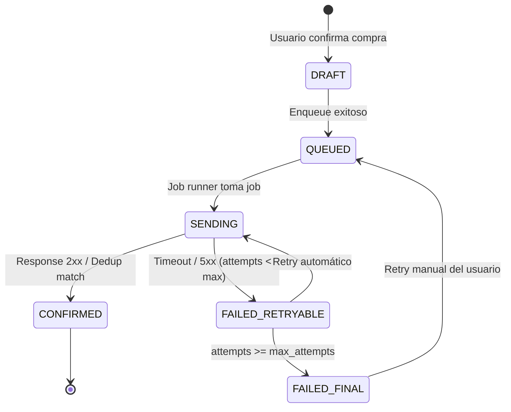

# Estados de Orden

## Estados Locales (app)

| Estado | Descripción | Transición desde | Transición a |
|--------|-------------|------------------|--------------|
| DRAFT | Orden creada localmente, aún no encolada | — | QUEUED |
| QUEUED | Encolada en sync_queue, esperando procesamiento | DRAFT | SENDING |
| SENDING | Job runner enviando a WooCommerce | QUEUED, FAILED_RETRYABLE | CONFIRMED, FAILED_RETRYABLE, FAILED_FINAL |
| CONFIRMED | Confirmada por WooCommerce (tiene order_id remoto) | SENDING | — |
| FAILED_RETRYABLE | Fallo temporal, se puede reintentar | SENDING | SENDING, FAILED_FINAL |
| FAILED_FINAL | Fallo definitivo, requiere acción del usuario | FAILED_RETRYABLE | QUEUED (retry manual) |

## Diagrama de transiciones

## Mapeo a Estados WooCommerce

| Estado Local | Estado WooCommerce | Notas |
|-------------|-------------------|-------|
| CONFIRMED | pending | Orden recién creada en Woo |
| CONFIRMED | processing | Administrador procesando |
| CONFIRMED | completed | Orden entregada |
| CONFIRMED | cancelled | Orden cancelada por admin |
| CONFIRMED | failed | Pago fallido (si aplica) |

## Estados Visibles al Usuario

La app simplifica los estados para el usuario final:

| Estado interno | Mostrado al usuario | Icono/Color |
|---------------|---------------------|-------------|
| DRAFT, QUEUED, SENDING | "Procesando..." | Spinner / Azul |
| CONFIRMED (pending/processing) | "Pendiente" | Reloj / Naranja |
| CONFIRMED (completed) | "Entregado" | Check / Verde |
| FAILED_RETRYABLE | "Procesando..." | Spinner / Azul |
| FAILED_FINAL | "Error en pedido" | Alerta / Rojo |

## Reglas
- Solo se muestra al usuario "Pendiente" y "Entregado" como estados principales.
- "Procesando..." se usa para estados transitorios (draft, queued, sending, retryable).
- "Error en pedido" solo aparece en FAILED_FINAL con CTA de reintentar o contactar.

---

> Referenciado por: CLAUDE.md sección 11
> HUs Relacionadas: HU-FUNC-ORD-001, HU-FUNC-CHK-001, HU-UI-ORD-001
> Última actualización: 2026-03-01
