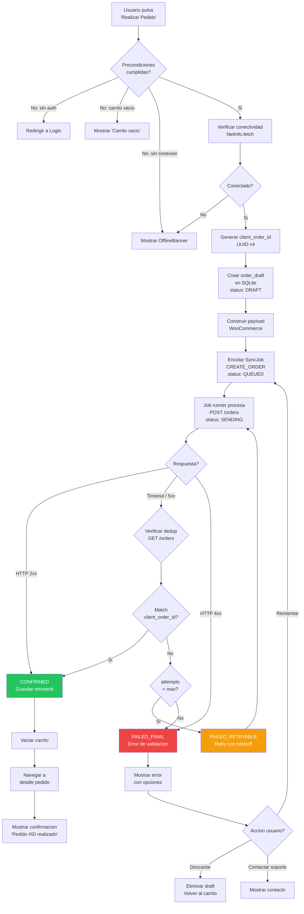

# Flujo Oficial de Checkout

## Descripcion General

El checkout es la **unica operacion que requiere conexion a internet** en la app. Este documento define el flujo paso a paso, el manejo de errores por escenario, y las reglas de negocio que gobiernan el proceso de compra.

El flujo transforma los `CartItem` del carrito local en un `Order` (draft) que se sincroniza con WooCommerce a traves del sistema de `sync_queue`.

---

## 1. Precondiciones

Antes de iniciar el checkout, se deben cumplir **todas** las siguientes condiciones:

| Precondicion | Verificacion | Accion si falla |
|---|---|---|
| Usuario autenticado | Token JWT valido en `expo-secure-store` | Redirigir a Login |
| Carrito no vacio | `SELECT COUNT(*) FROM cart_items > 0` | Mostrar mensaje "Carrito vacio" |
| Conexion disponible | `NetInfo.fetch().isConnected === true` | Mostrar `OfflineBanner` + bloquear boton "Realizar Pedido" |
| Sin checkout activo | No existe `Order` con `statusLocal IN ('DRAFT', 'QUEUED', 'SENDING')` para este usuario | Mostrar estado del pedido en progreso |

---

## 2. Pasos del Flujo

### Paso 1: Usuario pulsa "Realizar Pedido"

- Boton disponible solo si precondiciones se cumplen.
- Se deshabilita el boton inmediatamente para evitar doble tap.
- Se muestra indicador de carga (spinner).

### Paso 2: Verificar conectividad

```typescript
const netState = await NetInfo.fetch();
if (!netState.isConnected) {
  // Mostrar error: "Se requiere conexion a internet para realizar el pedido"
  // Rehabilitar boton
  return;
}
```

### Paso 3: Validar items del carrito (pre-check opcional)

- Si hay conexion, se puede hacer un pre-check de stock consultando los productos.
- **En MVP**: Este paso es opcional. WooCommerce validara stock al procesar la orden.
- Si se implementa: `GET /products?include=id1,id2,...` para verificar `stock_quantity`.

### Paso 4: Generar `client_order_id`

- Se genera un UUID v4 unico para esta orden.
- Este ID es la clave de idempotencia. Ver [idempotencia.md](./idempotencia.md).
- **NUNCA** se reutiliza un `client_order_id` existente.

```typescript
const clientOrderId = uuid.v4(); // Ejemplo: "a1b2c3d4-e5f6-7890-abcd-ef1234567890"
```

### Paso 5: Crear `order_draft` en SQLite

- Se leen todos los `CartItem` de la tabla `cart_items`.
- Se serializan a JSON como `itemsJson`.
- Se calcula `subtotal = SUM(priceSnapshot * quantity)`.
- Se inserta el registro `Order` con `statusLocal = 'DRAFT'`.

```typescript
const order: Order = {
  id: uuid.v4(),
  remoteId: null,
  clientOrderId: clientOrderId,
  statusLocal: 'DRAFT',
  statusRemote: null,
  itemsJson: JSON.stringify(cartItems),
  subtotal: calculateSubtotal(cartItems),
  discount: null,
  shipping: null,
  total: calculateSubtotal(cartItems), // Provisional, WooCommerce recalcula
  createdAt: new Date().toISOString(),
  updatedAt: new Date().toISOString(),
  lastSyncAt: null,
};
```

Ver modelo completo en [modelo-order-draft.md](./modelo-order-draft.md).

### Paso 6: Construir payload WooCommerce

- Se transforma el draft al formato esperado por `POST /wp-json/wc/v3/orders`.
- Se incluyen `line_items`, `meta_data` (con `client_order_id`), `customer_id`, `billing`, `shipping`.
- Ver estructura completa en [modelo-order-draft.md](./modelo-order-draft.md) seccion 5.

### Paso 7: Encolar job `CREATE_ORDER` en `sync_queue`

- Se crea un `SyncJob` con `jobType = 'CREATE_ORDER'` y `payloadJson` con el payload.
- Se actualiza `Order.statusLocal` de `DRAFT` a `QUEUED`.
- Transicion de estado: `DRAFT -> QUEUED`.

```typescript
const syncJob: SyncJob = {
  id: uuid.v4(),
  jobType: 'CREATE_ORDER',
  payloadJson: JSON.stringify(wooPayload),
  status: 'PENDING',
  attempts: 0,
  maxAttempts: 3,
  lastAttemptAt: null,
  errorMessage: null,
  createdAt: new Date().toISOString(),
  updatedAt: new Date().toISOString(),
};
```

### Paso 8: Job runner procesa el job

- El job runner toma el job con `status = 'PENDING'`.
- Actualiza `SyncJob.status` a `'SENDING'` y `Order.statusLocal` a `'SENDING'`.
- Envia `POST /wp-json/wc/v3/orders` con el payload.
- Transicion de estado: `QUEUED -> SENDING`.

### Paso 9: Manejar respuesta

#### a) Exito (HTTP 2xx)

1. `Order.statusLocal = 'CONFIRMED'`
2. `Order.remoteId = response.data.id`
3. `Order.statusRemote = response.data.status` (tipicamente `"pending"`)
4. `Order.lastSyncAt = new Date().toISOString()`
5. `SyncJob.status = 'CONFIRMED'`
6. Registrar evento de telemetria: `order_confirmed`

#### b) Fallo temporal (Timeout / HTTP 5xx)

1. `SyncJob.attempts += 1`
2. Si `attempts < maxAttempts`:
   - `SyncJob.status = 'FAILED_RETRYABLE'`
   - `Order.statusLocal = 'FAILED_RETRYABLE'`
   - **Antes de reintentar**: Ejecutar verificacion de dedup (ver [idempotencia.md](./idempotencia.md))
   - Programar retry con backoff exponencial
3. Si `attempts >= maxAttempts`:
   - `SyncJob.status = 'FAILED_FINAL'`
   - `Order.statusLocal = 'FAILED_FINAL'`
   - Registrar evento: `order_failed_final`

#### c) Fallo definitivo (HTTP 4xx - validacion)

1. `SyncJob.status = 'FAILED_FINAL'`
2. `Order.statusLocal = 'FAILED_FINAL'`
3. `SyncJob.errorMessage = response.data.message`
4. Mostrar error especifico al usuario
5. Registrar evento: `order_validation_failed`

### Paso 10: Actualizar UI

- Navegar a la pantalla de detalle del pedido con el estado resultante.
- Si `CONFIRMED`: Mostrar confirmacion con numero de pedido.
- Si `FAILED_RETRYABLE`: Mostrar "Procesando..." (transparente al usuario).
- Si `FAILED_FINAL`: Mostrar error con opciones de reintentar o descartar.

---

## 3. Manejo de Errores por Escenario

| Escenario | HTTP Status | Codigo Error | Accion Automatica | UI al Usuario |
|---|---|---|---|---|
| Red no disponible | N/A | `ERR_NETWORK` | No encolar, bloquear checkout | "Se requiere conexion a internet" |
| Timeout en POST | N/A | `ERR_TIMEOUT` | Verificar dedup + retry | "Procesando tu pedido..." |
| Servidor caido | 503 | `ERR_SERVER_DOWN` | Retry con backoff | "Procesando tu pedido..." |
| Error intermitente | 500 | `ERR_SERVER_500` | Retry con backoff | "Procesando tu pedido..." |
| API degradada | 502/504 | `ERR_SERVER_DEGRADED` | Retry con backoff | "Procesando tu pedido..." |
| Token expirado | 401 | `ERR_AUTH_EXPIRED` | Intentar refresh token | "Sesion expirada, inicia sesion" |
| Token invalido | 401 | `ERR_AUTH_INVALID` | Logout + redirigir login | "Sesion invalida" |
| Sin permisos | 403 | `ERR_AUTH_FORBIDDEN` | FAILED_FINAL | "No tienes permisos para esta accion" |
| Producto no encontrado | 404 | `ERR_NOT_FOUND` | FAILED_FINAL | "Producto no disponible" |
| Datos invalidos | 400 | `ERR_VALIDATION` | FAILED_FINAL | Mostrar detalle de error |
| Conflicto (orden duplicada) | 409 | `ERR_CONFLICT` | Verificar dedup | "Verificando pedido existente..." |
| Stock insuficiente | 400 | `ERR_STOCK_UNAVAILABLE` | FAILED_FINAL | "Stock insuficiente para [producto]" |
| Error al cotizar | 500 | `ERR_QUOTE_FAILED` | Retry 1 vez | "Error calculando costos" |
| Error creando orden | 500 | `ERR_ORDER_FAILED` | Retry con backoff | "Procesando tu pedido..." |
| Error de envio/shipping | 500 | `ERR_SHIPPING_FAILED` | Retry 1 vez | "Error calculando envio" |

---

## 4. Reglas de Negocio

| Regla | Descripcion |
|---|---|
| Maximo de reintentos | 3 intentos antes de marcar como `FAILED_FINAL` |
| Checkout offline | **Bloqueado**. El checkout requiere conexion activa |
| Procesamiento de pago | **No se maneja en la app**. WooCommerce gestiona pagos externamente |
| Idempotencia | Toda orden lleva `client_order_id` (UUID v4). Ver [idempotencia.md](./idempotencia.md) |
| Dedup antes de retry | **Obligatorio** verificar ordenes existentes por `client_order_id` antes de reintentar |
| Backoff exponencial | Reintentos con delays de 2s, 4s, 8s (base 2) |
| Un checkout a la vez | No se permite iniciar un nuevo checkout si hay uno en progreso |
| Precio de referencia | `priceSnapshot` es referencia local; WooCommerce usa su precio actual al procesar |
| Carrito inmutable durante checkout | No se permite modificar el carrito mientras hay un checkout activo |

---

## 5. Post-Checkout

### En caso de CONFIRMED

1. Vaciar carrito: `DELETE FROM cart_items`
2. Registrar evento de telemetria: `checkout_completed`
3. Navegar a pantalla de detalle del pedido
4. Mostrar mensaje de exito: "Pedido #[remoteId] realizado con exito"

### En caso de FAILED_FINAL

1. Conservar carrito intacto (no vaciar)
2. Mostrar opciones:
   - "Reintentar": Crea nuevo `SyncJob`, transiciona `FAILED_FINAL -> QUEUED`
   - "Descartar pedido": Elimina el draft, regresa al carrito
   - "Contactar soporte": Enlace o informacion de contacto
3. Registrar evento: `checkout_failed_final_shown`

### En caso de FAILED_RETRYABLE (transparente)

1. El usuario ve "Procesando..." (no se muestra error)
2. El sistema reintenta automaticamente en background
3. Al resolverse, actualizar UI con resultado final

---

## 6. Diagrama de Flujo Completo



---

> Referenciado por: CLAUDE.md seccion 11. Ver tambien: [modelo-order-draft.md](./modelo-order-draft.md), [estados-orden.md](./estados-orden.md), [idempotencia.md](./idempotencia.md), [reconciliacion.md](./reconciliacion.md)
> HUs Relacionadas: HU-FUNC-CHK-001, HU-TECH-CHK-001, HU-NF-CHK-001
> Ultima actualizacion: 2026-03-01
