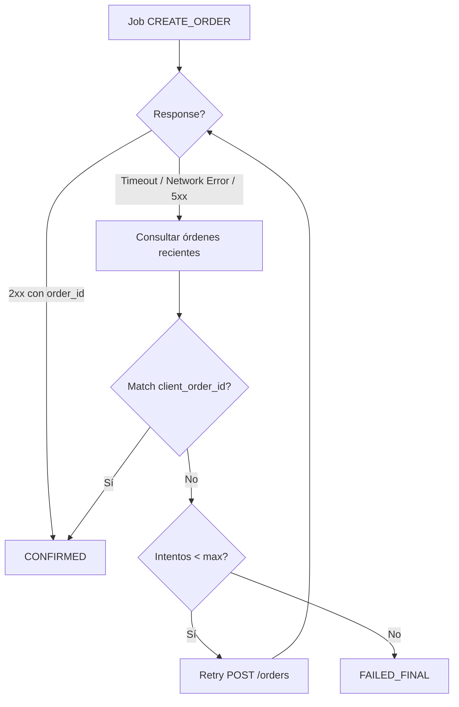

# Estrategia de Idempotencia

## Principio
Cero duplicidad de órdenes. Toda operación de creación de orden debe ser idempotente.

## Mecanismo: client_order_id

### Generación
- Se genera un UUID v4 como `client_order_id` ANTES de encolar el job CREATE_ORDER.
- Se almacena en el `order_draft` local (SQLite).
- Se envía como metadata en el request a WooCommerce.

### Flujo normal
1. App genera `client_order_id` (UUID v4)
2. Crea `order_draft` en SQLite con este ID
3. Encola job CREATE_ORDER con payload incluyendo `client_order_id`
4. Job runner envía POST /orders con `client_order_id` en metadata
5. WooCommerce guarda `client_order_id` como meta_data de la orden
6. App recibe response con order_id → CONFIRMED

### Flujo de respuesta incierta (timeout, network error, 5xx)
1. Job runner NO recibe confirmación clara
2. Marca job como FAILED_RETRYABLE
3. Antes de reintentar:
   a. GET /orders?customer={user_id}&orderby=date&order=desc&per_page=5
   b. Para cada orden reciente, verificar meta_data buscando `client_order_id`
   c. Si match encontrado → orden ya fue creada → marcar CONFIRMED
   d. Si no match → retry controlado (POST /orders de nuevo)
4. Máximo 3 intentos. Si agota → FAILED_FINAL con mensaje al usuario.

### Garantías
- El `client_order_id` es único por UUID v4 (colisión estadísticamente imposible).
- WooCommerce NO tiene dedup nativo, la verificación es responsabilidad de la app.
- La consulta de verificación siempre ocurre ANTES de un retry.

## Diagrama de decisión

## Reglas
- NUNCA enviar POST sin primero verificar dedup tras fallo.
- NUNCA asumir éxito sin response 2xx o match por consulta.
- Registrar evento de telemetría en cada dedup exitoso: `order_dedup_resolved`.

---

> Referenciado por: CLAUDE.md sección 10
> HUs Relacionadas: HU-TECH-CHK-001, HU-FUNC-CHK-001
> Última actualización: 2026-03-01
