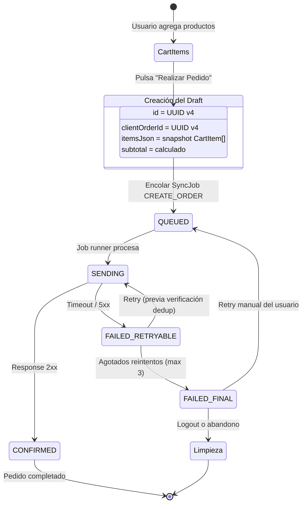

# Modelo Order Draft

## Descripción General

El `order_draft` es la representación local de un pedido en proceso de checkout. Se crea a partir de los ítems del carrito (`CartItem`) y evoluciona a través de los estados definidos en `OrderLocalStatus` hasta ser confirmado por WooCommerce o fallar de forma definitiva.

Este documento define la estructura completa del modelo, su ciclo de vida, y su relación con el sistema de sincronización.

---

## 1. Estructura del Modelo

Basado en la interfaz `Order` definida en `src/core/types/entities.ts`:

| Campo | Tipo | Requerido | Descripción |
|-------|------|-----------|-------------|
| `id` | `string` | Sí | Identificador local único (UUID v4). Clave primaria en SQLite. |
| `remoteId` | `string \| null` | No | ID asignado por WooCommerce tras confirmación (ej: `"12345"`). `null` hasta recibir response 2xx. |
| `clientOrderId` | `string` | Sí | UUID v4 generado ANTES de encolar. Usado para idempotencia/dedup. Nunca cambia una vez asignado. Ver [idempotencia.md](./idempotencia.md). |
| `statusLocal` | `OrderLocalStatus` | Sí | Estado actual del draft en la máquina de estados local. Valor inicial: `'DRAFT'`. Ver [estados-orden.md](./estados-orden.md). |
| `statusRemote` | `string \| null` | No | Estado WooCommerce (`pending`, `processing`, `completed`, etc.). `null` hasta primera reconciliación. |
| `itemsJson` | `string` | Sí | JSON serializado del array de `CartItem[]` capturado al momento de crear el draft. Snapshot inmutable de los ítems. |
| `subtotal` | `number \| null` | No | Suma de `priceSnapshot * quantity` de todos los ítems. Calculado al crear el draft. |
| `discount` | `number \| null` | No | Monto de descuento aplicado (cupón). `null` si no aplica en MVP. |
| `shipping` | `number \| null` | No | Costo de envío. `null` hasta que WooCommerce calcule (si aplica). |
| `total` | `number \| null` | No | Total final: `subtotal - discount + shipping`. Puede ser recalculado por WooCommerce. |
| `createdAt` | `string` | Sí | Timestamp ISO 8601 de creación del draft. |
| `updatedAt` | `string` | Sí | Timestamp ISO 8601 de última modificación local. |
| `lastSyncAt` | `string \| null` | No | Timestamp de última sincronización exitosa con WooCommerce. `null` si nunca sincronizó. |

---

## 2. Ciclo de Vida

### Creación (desde carrito)

1. El usuario pulsa "Realizar Pedido" en la pantalla de carrito.
2. La app lee todos los `CartItem` de SQLite.
3. Se genera un `client_order_id` (UUID v4).
4. Se serializa el array de `CartItem[]` a `itemsJson`.
5. Se calcula `subtotal` como `SUM(priceSnapshot * quantity)`.
6. Se inserta el registro `Order` en SQLite con `statusLocal = 'DRAFT'`.

### Enriquecimiento (durante checkout)

7. Se construye el payload WooCommerce (ver sección 5).
8. Se crea un `SyncJob` de tipo `CREATE_ORDER` en `sync_queue` con el payload.
9. El `statusLocal` transiciona a `'QUEUED'`.

### Procesamiento (sync)

10. El job runner toma el job → `statusLocal = 'SENDING'`.
11. Se envía POST a WooCommerce.
12. Según la respuesta:
    - **2xx**: `statusLocal = 'CONFIRMED'`, se guarda `remoteId`, se actualiza `lastSyncAt`.
    - **Timeout/5xx**: `statusLocal = 'FAILED_RETRYABLE'`, se verifica dedup antes de reintentar.
    - **4xx**: `statusLocal = 'FAILED_FINAL'`, se notifica al usuario.

### Diagrama del Ciclo de Vida



---

## 3. Campos Calculados vs. Almacenados

### Campos Snapshot (inmutables tras creación)

| Campo | Origen | Momento de captura |
|-------|--------|--------------------|
| `itemsJson` | `CartItem[]` serializado | Al crear el draft |
| `priceSnapshot` (dentro de items) | Precio del producto al momento de agregarlo al carrito | Al agregar al carrito |
| `clientOrderId` | UUID v4 generado | Al crear el draft |
| `createdAt` | Timestamp actual | Al crear el draft |

### Campos Calculados (derivados de snapshots)

| Campo | Fórmula | Momento de cálculo |
|-------|---------|-------------------|
| `subtotal` | `SUM(item.priceSnapshot * item.quantity)` para todos los items en `itemsJson` | Al crear el draft |
| `total` | `subtotal - (discount ?? 0) + (shipping ?? 0)` | Al crear el draft; puede ser sobrescrito por WooCommerce tras confirmación |

### Campos Actualizados por WooCommerce (post-confirmación)

| Campo | Cuándo se actualiza |
|-------|---------------------|
| `remoteId` | Al recibir response 2xx |
| `statusRemote` | Al recibir response 2xx y en cada reconciliación |
| `shipping` | WooCommerce calcula el envío real |
| `total` | WooCommerce puede recalcular con impuestos/envío |
| `discount` | WooCommerce valida y aplica cupones |
| `lastSyncAt` | Tras cada sync exitoso |

---

## 4. Relación con sync_queue

El `order_draft` se mapea a un `SyncJob` (definido en `src/core/types/entities.ts`) al momento de encolar:

| Campo SyncJob | Valor | Descripción |
|---------------|-------|-------------|
| `id` | UUID v4 (nuevo) | ID único del job |
| `jobType` | `'CREATE_ORDER'` | Tipo de operación |
| `payloadJson` | JSON del payload WooCommerce | Ver sección 5 |
| `status` | `'PENDING'` | Estado inicial del job |
| `attempts` | `0` | Contador de intentos |
| `maxAttempts` | `3` | Máximo de reintentos permitidos |
| `lastAttemptAt` | `null` | Se actualiza en cada intento |
| `errorMessage` | `null` | Se llena en caso de error |
| `createdAt` | Timestamp actual | Momento de encolado |
| `updatedAt` | Timestamp actual | Última modificación |

### Correspondencia de estados

| SyncJob Status | Order statusLocal | Descripción |
|----------------|-------------------|-------------|
| `PENDING` | `QUEUED` | Job creado, esperando procesamiento |
| `SENDING` | `SENDING` | Job en ejecución |
| `CONFIRMED` | `CONFIRMED` | Operación exitosa |
| `FAILED_RETRYABLE` | `FAILED_RETRYABLE` | Fallo temporal |
| `FAILED_FINAL` | `FAILED_FINAL` | Fallo definitivo |

---

## 5. Payload WooCommerce

Estructura JSON enviada a `POST /wp-json/wc/v3/orders`:

```json
{
  "customer_id": 42,
  "status": "pending",
  "billing": {
    "first_name": "Juan",
    "last_name": "Pérez",
    "email": "juan@ejemplo.com",
    "phone": "555-1234",
    "address_1": "Calle Principal 123",
    "city": "Ciudad",
    "state": "Estado",
    "postcode": "12345",
    "country": "MX"
  },
  "shipping": {
    "first_name": "Juan",
    "last_name": "Pérez",
    "address_1": "Calle Principal 123",
    "city": "Ciudad",
    "state": "Estado",
    "postcode": "12345",
    "country": "MX"
  },
  "line_items": [
    {
      "product_id": 101,
      "quantity": 2
    },
    {
      "product_id": 205,
      "quantity": 1
    }
  ],
  "meta_data": [
    {
      "key": "client_order_id",
      "value": "a1b2c3d4-e5f6-7890-abcd-ef1234567890"
    },
    {
      "key": "app_version",
      "value": "1.0.0"
    }
  ]
}
```

### Notas sobre el payload

- **`customer_id`**: ID del usuario autenticado en WooCommerce. Se obtiene del token/perfil almacenado.
- **`line_items`**: Se construyen a partir de `itemsJson`. Se usa `productId` (mapeado a `product_id` remoto) y `quantity`. El precio NO se envía; WooCommerce usa su precio actual.
- **`meta_data.client_order_id`**: Clave para idempotencia. Ver [idempotencia.md](./idempotencia.md).
- **`billing`/`shipping`**: Datos del perfil del usuario. En MVP pueden ser los mismos.
- **No se envían datos de pago**: WooCommerce maneja el procesamiento de pago externamente.

---

## 6. Limpieza

### Escenarios de limpieza de drafts

| Escenario | Acción | Momento |
|-----------|--------|---------|
| **Logout** | `DELETE FROM orders WHERE status_local = 'DRAFT'` | Durante secuencia de logout. Ver [politica-datos-sensibles.md](./politica-datos-sensibles.md). |
| **Confirmación exitosa** | El draft no se elimina; se actualiza a `CONFIRMED` con `remoteId`. Se conserva como historial. | Al recibir response 2xx. |
| **Abandono** | Drafts con `statusLocal = 'DRAFT'` y `updatedAt` mayor a 24 horas se pueden limpiar periódicamente. | En arranque de app o en intervalo de mantenimiento. |
| **Fallo definitivo resuelto** | El usuario decide descartar → `DELETE FROM orders WHERE id = ?`. | Acción explícita del usuario. |

### Reglas de retención

- Los drafts en estado `DRAFT` (nunca encolados) se limpian en logout.
- Los drafts en estado `CONFIRMED` se conservan indefinidamente como historial local.
- Los drafts en estado `FAILED_FINAL` se conservan hasta acción del usuario (reintentar o descartar).
- Los jobs asociados en `sync_queue` se limpian junto con su draft (excepto los `CONFIRMED`).

---

> Referenciado por: CLAUDE.md, [estados-orden.md](./estados-orden.md), [idempotencia.md](./idempotencia.md), [flujo-checkout.md](./flujo-checkout.md)
> HUs Relacionadas: HU-FUNC-CHK-001, HU-TECH-CHK-001
> Última actualización: 2026-03-01
