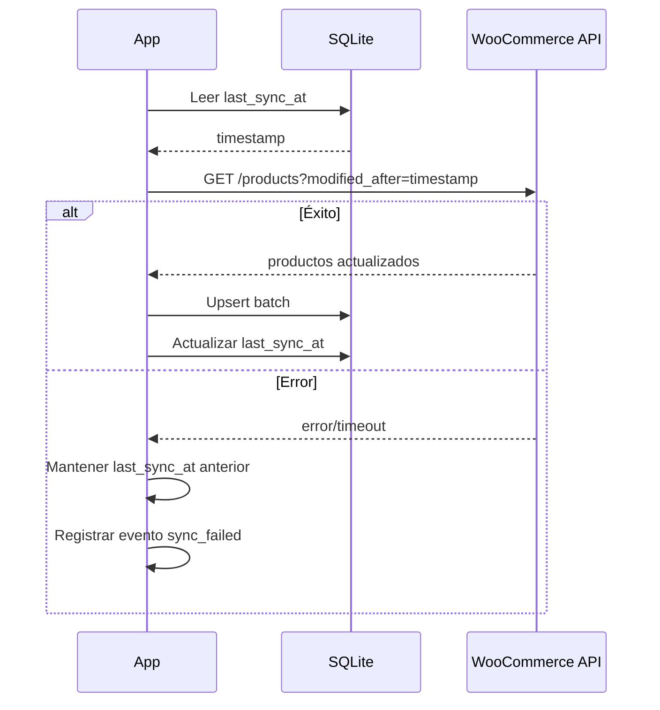

# Estrategia de Reconciliación Local-Remoto

## Principio
Remote siempre gana, excepto carrito local. Pull incremental sin bloquear UI.

## Pull Incremental

### Mecanismo
- Query: `GET /resource?modified_after={last_sync_at}&orderby=modified&order=asc`
- Procesar respuesta en lotes (paginación)
- Actualizar registros locales via upsert
- Actualizar `last_sync_at` solo tras sync exitoso completo

### Por entidad

| Entidad | Trigger de sync | Endpoint pattern | Estrategia |
|---------|----------------|------------------|-----------|
| Productos | Al reconectar, al abrir catálogo | GET /products?modified_after=X | Upsert batch, remote gana |
| Pedidos | Al reconectar, al abrir pedidos | GET /orders?customer=X&modified_after=X | Upsert, remote gana |
| Carrito | Al reconectar (si se implementa sync) | N/A en MVP | Local-first, merge manual |

### Frecuencia
- **Al reconectar**: Después de detectar reconexión vía NetInfo
- **Al abrir pantalla**: Pull al entrar a Catálogo o Pedidos (debounce 30s)
- **Manual**: Pull-to-refresh en listas

## Resolución de Conflictos

### Productos
- **Regla**: Remote siempre gana.
- **Acción**: Upsert con datos del servidor.
- **Nota**: Si un producto en carrito fue eliminado/modificado remotamente, marcar para revisión del usuario al abrir carrito.

### Pedidos
- **Regla**: Remote siempre gana.
- **Acción**: Actualizar status_remote del pedido local.
- **Excepción**: Si la orden local está en SENDING (sync en progreso), NO sobrescribir.

### Carrito
- **Regla**: Local-first en MVP.
- **Acción**: El carrito vive solo en SQLite local. No se sincroniza con WooCommerce en MVP.
- **Futuro (Phase 2)**: Merge con timestamp más reciente.

## Manejo de Errores en Sync

| Escenario | Acción | Telemetría |
|-----------|--------|-----------|
| Network error durante sync | Abortar, mantener last_sync_at anterior | sync_failed |
| Timeout | Abortar, reintentar en próximo trigger | sync_timeout |
| Respuesta parcial (paginación) | Guardar progreso, continuar en próximo trigger | sync_partial |
| Datos corruptos | Log + skip registro, continuar | sync_data_error |

## Diagrama

---

> Referenciado por: CLAUDE.md sección 9
> HUs Relacionadas: HU-TECH-CAT-001, HU-TECH-SYNC-001
> Última actualización: 2026-03-01
