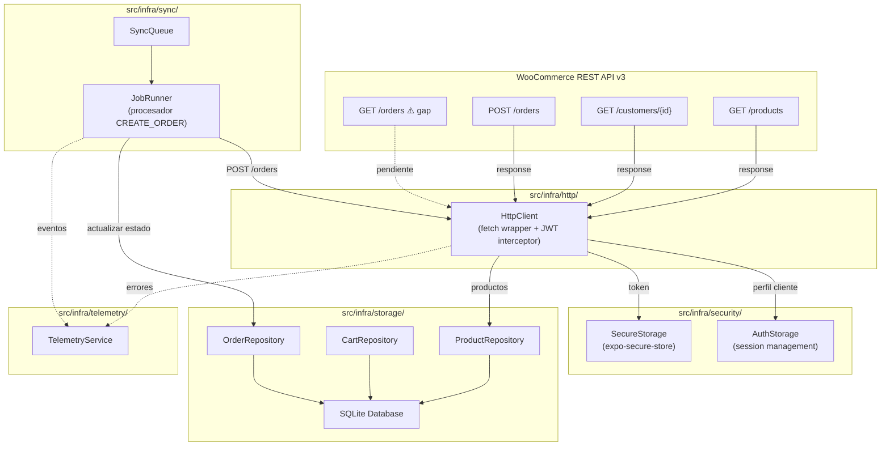
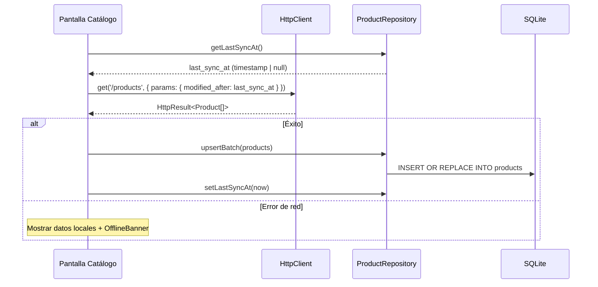
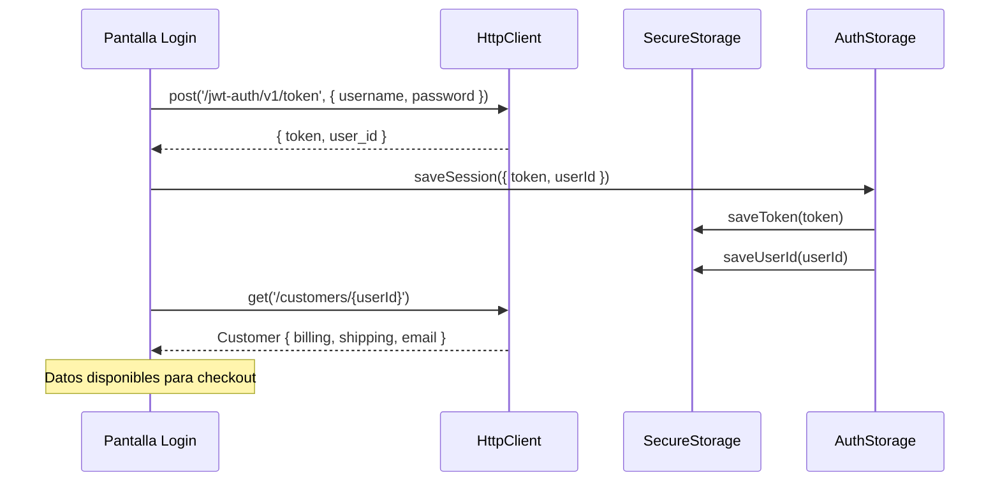
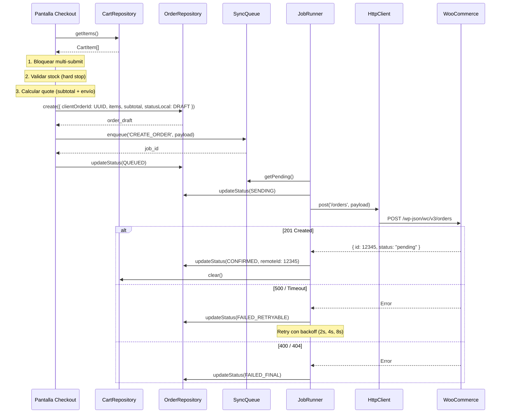
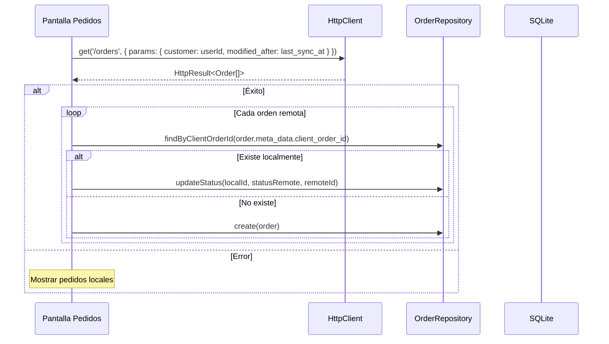

# Arquitectura de Integración WooCommerce

## Descripción

Este documento describe cómo la app móvil interactúa con la API WooCommerce REST v3 a través de los módulos existentes en `src/infra/`. Define los 4 flujos principales y el mapeo entre endpoints y componentes internos.

---

## Diagrama General de Componentes



---

## Flujo 1: Catálogo (Pull Incremental de Productos)

### Endpoint

`GET /wp-json/wc/v3/products`

### Secuencia



### Módulos Involucrados

| Módulo | Archivo | Responsabilidad |
|--------|---------|-----------------|
| HTTP | `src/infra/http/httpClient.ts` | `HttpClient.get('/products')` con Bearer token |
| Storage | `src/infra/storage/repositories/productRepository.ts` | `upsertBatch()`, `getLastSyncAt()`, `setLastSyncAt()` |
| UI | `src/ui/components/OfflineBanner.tsx` | Indicar modo offline |
| UI | `src/ui/hooks/useNetworkStatus.ts` | Detectar conectividad |

### Reglas (por [reconciliacion.md](./reconciliacion.md))

- **Trigger**: Al reconectar + al abrir pantalla catálogo (debounce 30s)
- **Parámetro**: `modified_after=last_sync_at` para pull incremental
- **Reconciliación**: Remote siempre gana (upsert por ID)
- **Offline**: Mostrar productos locales de SQLite
- **UI**: No bloquear durante sync

### Mapeo de Datos

```
WooCommerce Product → App Product (SQLite)
─────────────────────────────────────────
id                  → id
name                → name
price (string)      → price (parseFloat)
stock_quantity      → stockQuantity
categories[0].name  → category
images[0].src       → imageUrl
{objeto completo}   → dataJson (JSON.stringify)
date_modified       → updatedAt
```

---

## Flujo 2: Autenticación y Perfil de Cliente

### Endpoints

1. Login: Autenticación JWT (endpoint de autenticación — fuera del scope WooCommerce API v3)
2. Perfil: `GET /wp-json/wc/v3/customers/{id}`

### Secuencia



### Módulos Involucrados

| Módulo | Archivo | Responsabilidad |
|--------|---------|-----------------|
| Security | `src/infra/security/secureStorage.ts` | `saveToken()`, `saveUserId()`, `getToken()` |
| Security | `src/infra/security/authStorage.ts` | `saveSession()`, `isAuthenticated()`, `logout()` |
| HTTP | `src/infra/http/httpClient.ts` | Interceptor inyecta Bearer token en cada request |

### Datos del Cliente Usados

| Campo | Uso |
|-------|-----|
| `id` | `customer_id` en payload de orden |
| `billing` | Datos de facturación pre-llenados en checkout |
| `shipping` | Datos de envío pre-llenados en checkout |
| `email` | Identificación del usuario |

### Seguridad

- Token JWT almacenado en `expo-secure-store` (cifrado nativo del OS)
- `userId` almacenado en `expo-secure-store`
- Contraseña NUNCA almacenada (ver [politica-datos-sensibles.md](./politica-datos-sensibles.md))
- En logout: `AuthStorage.logout()` limpia SecureStore + datos sensibles de SQLite

---

## Flujo 3: Checkout (Crear Orden)

### Endpoint

`POST /wp-json/wc/v3/orders`

### Secuencia



### Módulos Involucrados

| Módulo | Archivo | Responsabilidad |
|--------|---------|-----------------|
| Storage | `src/infra/storage/repositories/cartRepository.ts` | `getItems()`, `clear()` |
| Storage | `src/infra/storage/repositories/orderRepository.ts` | `create()`, `updateStatus()`, `findByClientOrderId()` |
| Sync | `src/infra/sync/syncQueue.ts` | `enqueue('CREATE_ORDER', payload)` |
| Sync | `src/infra/sync/jobRunner.ts` | Procesador `CREATE_ORDER` |
| HTTP | `src/infra/http/httpClient.ts` | `HttpClient.post('/orders', payload)` |
| Telemetry | `src/infra/telemetry/telemetryService.ts` | Eventos de checkout |

### Payload Construido por la App

Ver [order-contract.md](../07_api-contracts/order-contract.md) para el contrato completo.

```
CartItem[] → line_items[]
  productId → product_id
  quantity  → quantity
  priceSnapshot → (NO se envía)

+ customer_id (SecureStorage)
+ billing/shipping (perfil del cliente)
+ meta_data[client_order_id] (UUID v4)
```

### Idempotencia

- `client_order_id` (UUID v4) se genera ANTES de encolar
- Se envía en `meta_data` del payload
- Antes de retry tras timeout/5xx: verificar dedup (ver [idempotencia.md](./idempotencia.md))
- Garantía: CERO duplicidad de órdenes

### Referencias

- [flujo-checkout.md](./flujo-checkout.md) — Flujo paso a paso completo
- [modelo-order-draft.md](./modelo-order-draft.md) — Modelo del draft
- [idempotencia.md](./idempotencia.md) — Estrategia de deduplicación
- [order-contract.md](../07_api-contracts/order-contract.md) — Contrato del payload

---

## Flujo 4: Pedidos (Pull Incremental de Órdenes)

### Endpoint

`GET /wp-json/wc/v3/orders` — **⚠️ NO confirmado en PDF de referencia**

> **Gap identificado**: Este endpoint es necesario para el pull incremental de pedidos pero no aparece en el documento `API_Reference_WooCommerce.pdf`. Registrado en [woocommerce-endpoints.md](../07_api-contracts/woocommerce-endpoints.md) y [README.md](../07_api-contracts/README.md).

### Secuencia (Diseño Previsto)



### Módulos Involucrados

| Módulo | Archivo | Responsabilidad |
|--------|---------|-----------------|
| HTTP | `src/infra/http/httpClient.ts` | `HttpClient.get('/orders')` |
| Storage | `src/infra/storage/repositories/orderRepository.ts` | `getRecent()`, `findByClientOrderId()`, `updateStatus()` |

### Reconciliación (por [reconciliacion.md](./reconciliacion.md))

- **Trigger**: Al abrir pantalla Pedidos + al reconectar
- **Parámetro**: `customer={userId}&modified_after=last_sync_at`
- **Reconciliación**: Remote siempre gana para `statusRemote`
- **Offline**: Mostrar pedidos locales de SQLite

### Estados Visibles al Usuario (MVP)

| Estado | Descripción |
|--------|-------------|
| Pendiente | `statusRemote` = `pending` o `processing` |
| Entregado | `statusRemote` = `completed` |

---

## Resumen de Integración

| Flujo | Endpoint | Método | Módulos | Estado |
|-------|----------|--------|---------|--------|
| Catálogo | `/products` | GET | HTTP → ProductRepo → SQLite | Confirmado en PDF |
| Auth/Perfil | `/customers/{id}` | GET | HTTP → SecureStorage → AuthStorage | Confirmado en PDF |
| Checkout | `/orders` | POST | CartRepo → OrderRepo → SyncQueue → JobRunner → HTTP | Confirmado en PDF |
| Pedidos | `/orders` | GET | HTTP → OrderRepo → SQLite | ⚠️ Gap — No en PDF |

---

## Configuración Requerida

La URL base de WooCommerce se configura en `src/core/config/index.ts`:

```typescript
Config.api = {
  baseUrl: '', // Se define en runtime (variable de entorno)
  timeout: 15000,
}
```

- La URL base NO se hardcodea en código
- Se define mediante variable de entorno o configuración segura
- Ver [api-security.md](../08_non-functional/api-security.md)

---

> HUs Relacionadas: HU-FUNC-AUTH-001, HU-FUNC-CAT-001, HU-TECH-CAT-001, HU-FUNC-CHK-001, HU-FUNC-ORD-001, HU-TECH-SYNC-001
> Última actualización: 2026-03-04
