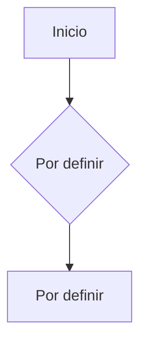

# Flujo de Autenticación

## Descripción
Diagrama del flujo de autenticación de usuarios en la app.

## Diagrama

---

> **Estado**: PENDIENTE — Completar cuando se defina la estrategia de autenticación.
> Requiere ADR previo en `04_technical-decisions/`.
