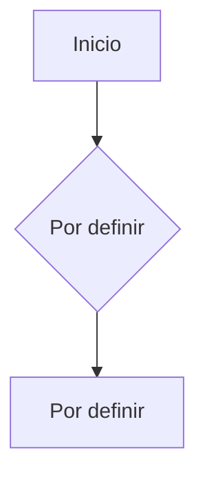

# Flujo de Compra

## Descripción
Diagrama del flujo de compra (checkout) en la app.
Este flujo requiere conexión a internet (excepción al modo offline-first).

## Diagrama

---

> **Estado**: PENDIENTE — Completar cuando se definan los contratos de API de WooCommerce.
> Requiere conexión a internet (no aplica offline-first).
