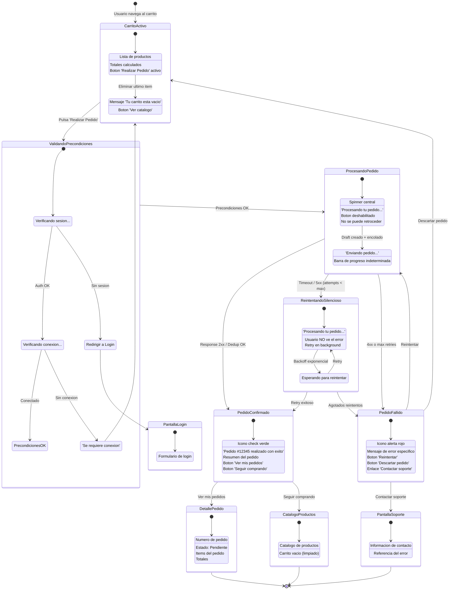

# Flujo de Compra -- Diagrama Completo

## Descripcion General

Este documento contiene los diagramas completos del flujo de compra (checkout) de la app WooCommerce Mobile. El checkout es la **unica operacion que requiere conexion a internet**, siendo la excepcion al modelo offline-first de la aplicacion.

Los diagramas cubren tres perspectivas complementarias:
1. **Flujo principal**: Vision completa del proceso de compra con todas las ramificaciones.
2. **Diagrama de secuencia**: Interaccion entre componentes del sistema.
3. **Diagrama de estados de UI**: Lo que el usuario ve en cada momento.

Para la documentacion detallada del flujo, consultar [flujo-checkout.md](../03_architecture/flujo-checkout.md).

---

## 1. Flujo Principal

Diagrama de flujo completo que cubre desde la validacion del carrito hasta la confirmacion o fallo del pedido, incluyendo verificacion de dedup y actualizaciones de UI.

```mermaid
flowchart TD
    START([Usuario en pantalla<br>de Carrito]) --> TAP[Pulsa boton<br>'Realizar Pedido']

    TAP --> PRE{Validar<br>precondiciones}

    PRE -->|Sin autenticacion| ERR_AUTH[Redirigir a Login]
    PRE -->|Carrito vacio| ERR_EMPTY[Mostrar<br>'Carrito vacio']
    PRE -->|Checkout activo| ERR_ACTIVE[Mostrar estado<br>del pedido activo]
    PRE -->|OK| CHECK_NET{Verificar<br>conectividad<br>NetInfo}

    CHECK_NET -->|Sin conexion| ERR_OFFLINE[Mostrar OfflineBanner<br>'Se requiere conexion']
    CHECK_NET -->|Conectado| DISABLE_BTN[Deshabilitar boton<br>Mostrar spinner]

    DISABLE_BTN --> STOCK{Pre-check<br>de stock?<br>Opcional MVP}
    STOCK -->|Omitir en MVP| GEN_ID
    STOCK -->|Verificar| STOCK_CHECK[GET /products<br>?include=ids]
    STOCK_CHECK --> STOCK_OK{Stock<br>disponible?}
    STOCK_OK -->|No| ERR_STOCK[ERR_STOCK_UNAVAILABLE<br>Mostrar productos<br>sin stock]
    STOCK_OK -->|Si| GEN_ID

    GEN_ID[Generar client_order_id<br>UUID v4] --> CREATE_DRAFT[Crear order_draft<br>en SQLite]

    CREATE_DRAFT --> SNAPSHOT[Snapshot CartItem<br>a itemsJson]
    SNAPSHOT --> CALC[Calcular subtotal<br>SUM price x qty]
    CALC --> SAVE_DRAFT[INSERT Order<br>statusLocal = DRAFT]

    SAVE_DRAFT --> BUILD_PAYLOAD[Construir payload<br>WooCommerce]
    BUILD_PAYLOAD --> ADD_META[Agregar meta_data<br>client_order_id<br>app_version]
    ADD_META --> ENQUEUE[Crear SyncJob<br>tipo CREATE_ORDER<br>status PENDING]
    ENQUEUE --> UPDATE_QUEUED[Actualizar Order<br>statusLocal = QUEUED]

    UPDATE_QUEUED --> JOB_RUNNER[Job Runner<br>toma el job]
    JOB_RUNNER --> UPDATE_SENDING[Actualizar Order<br>statusLocal = SENDING]
    UPDATE_SENDING --> POST_ORDER[POST /wp-json/wc/v3/orders<br>con payload]

    POST_ORDER --> RESPONSE{Respuesta<br>HTTP?}

    RESPONSE -->|2xx Exito| HANDLE_OK[Guardar remoteId<br>statusLocal = CONFIRMED<br>Actualizar lastSyncAt]
    RESPONSE -->|Timeout / 5xx| HANDLE_RETRY_CHECK
    RESPONSE -->|4xx Error| HANDLE_FAIL

    HANDLE_RETRY_CHECK[Incrementar attempts<br>en SyncJob] --> DEDUP{Verificar dedup<br>GET /orders recientes}

    DEDUP --> DEDUP_MATCH{Match<br>client_order_id?}
    DEDUP_MATCH -->|Si encontrado| HANDLE_OK
    DEDUP_MATCH -->|No encontrado| CHECK_ATTEMPTS{attempts<br>< maxAttempts<br>3?}

    CHECK_ATTEMPTS -->|Si| BACKOFF[Esperar backoff<br>exponencial<br>2s 4s 8s]
    BACKOFF --> UPDATE_RETRYABLE[statusLocal =<br>FAILED_RETRYABLE]
    UPDATE_RETRYABLE --> JOB_RUNNER

    CHECK_ATTEMPTS -->|No: agotados| HANDLE_FAIL

    HANDLE_FAIL[statusLocal = FAILED_FINAL<br>Guardar errorMessage] --> UI_ERROR

    HANDLE_OK --> CLEAR_CART[DELETE FROM cart_items<br>Vaciar carrito]
    CLEAR_CART --> TEL_OK[Telemetria:<br>order_confirmed<br>checkout_completed]
    TEL_OK --> NAV_DETAIL[Navegar a detalle<br>del pedido]
    NAV_DETAIL --> UI_SUCCESS[Mostrar:<br>'Pedido #ID realizado<br>con exito']

    UI_ERROR[Mostrar pantalla<br>de error con opciones] --> USER_ACTION{Accion<br>del usuario?}

    USER_ACTION -->|Reintentar| RETRY_MANUAL[Crear nuevo SyncJob<br>FAILED_FINAL a QUEUED]
    RETRY_MANUAL --> JOB_RUNNER
    USER_ACTION -->|Descartar| DISCARD[DELETE Order draft<br>Volver al carrito]
    USER_ACTION -->|Contactar soporte| SUPPORT[Mostrar info<br>de contacto]

    UI_SUCCESS --> END_OK([Fin: Pedido confirmado])
    DISCARD --> END_DISCARD([Fin: Pedido descartado])
    SUPPORT --> END_SUPPORT([Fin: Soporte])

    ERR_AUTH --> END_ERR([Fin: Error precondicion])
    ERR_EMPTY --> END_ERR
    ERR_OFFLINE --> END_ERR
    ERR_STOCK --> END_ERR
    ERR_ACTIVE --> END_ERR

    style HANDLE_OK fill:#22c55e,color:#fff
    style UI_SUCCESS fill:#22c55e,color:#fff
    style END_OK fill:#22c55e,color:#fff
    style HANDLE_FAIL fill:#ef4444,color:#fff
    style UI_ERROR fill:#ef4444,color:#fff
    style UPDATE_RETRYABLE fill:#f59e0b,color:#fff
    style BACKOFF fill:#f59e0b,color:#fff
    style ERR_AUTH fill:#9ca3af,color:#fff
    style ERR_EMPTY fill:#9ca3af,color:#fff
    style ERR_OFFLINE fill:#9ca3af,color:#fff
    style ERR_STOCK fill:#9ca3af,color:#fff
```

---

## 2. Diagrama de Secuencia

Interaccion completa entre los participantes del sistema, desde que el usuario confirma la compra hasta que el pedido es confirmado o falla, incluyendo flujos de error y retry.

```mermaid
sequenceDiagram
    participant U as Usuario
    participant UI as App (UI)
    participant DB as SQLite
    participant SQ as SyncQueue
    participant JR as JobRunner
    participant API as WooCommerce API

    Note over U,API: === INICIO DEL CHECKOUT ===

    U->>UI: Pulsa "Realizar Pedido"
    UI->>UI: Verificar precondiciones<br>(auth, carrito, conexion)

    alt Precondiciones no cumplidas
        UI-->>U: Mostrar error correspondiente<br>(login, carrito vacio, offline)
    end

    UI->>UI: Deshabilitar boton + spinner
    UI->>UI: Generar client_order_id (UUID v4)

    Note over UI,DB: === CREAR ORDER DRAFT ===

    UI->>DB: SELECT * FROM cart_items
    DB-->>UI: CartItem[] (items del carrito)

    UI->>UI: Serializar items a JSON<br>Calcular subtotal

    UI->>DB: INSERT INTO orders<br>(statusLocal = 'DRAFT')
    DB-->>UI: OK

    Note over UI,SQ: === ENCOLAR JOB ===

    UI->>UI: Construir payload WooCommerce<br>(line_items, meta_data, billing)

    UI->>SQ: INSERT SyncJob<br>(CREATE_ORDER, PENDING)
    SQ-->>UI: OK

    UI->>DB: UPDATE orders SET<br>statusLocal = 'QUEUED'
    DB-->>UI: OK

    UI-->>U: Mostrar "Procesando tu pedido..."

    Note over SQ,API: === JOB RUNNER PROCESA ===

    JR->>SQ: SELECT job WHERE<br>status = 'PENDING' LIMIT 1
    SQ-->>JR: SyncJob (CREATE_ORDER)

    JR->>SQ: UPDATE status = 'SENDING'
    JR->>DB: UPDATE orders SET<br>statusLocal = 'SENDING'

    JR->>API: POST /wp-json/wc/v3/orders<br>{line_items, meta_data, billing, shipping}

    alt Exito (HTTP 2xx)
        API-->>JR: 201 Created<br>{id: 12345, status: "pending"}

        JR->>DB: UPDATE orders SET<br>statusLocal = 'CONFIRMED'<br>remoteId = '12345'<br>lastSyncAt = now()
        JR->>SQ: UPDATE status = 'CONFIRMED'

        JR->>DB: DELETE FROM cart_items
        JR->>DB: INSERT telemetry<br>(order_confirmed)

        JR-->>UI: Notificar: orden confirmada
        UI-->>U: Navegar a detalle pedido<br>"Pedido #12345 realizado"

    else Timeout o HTTP 5xx
        API-->>JR: Timeout / 503 Service Unavailable

        JR->>SQ: UPDATE attempts += 1

        Note over JR,API: === VERIFICACION DEDUP ===

        JR->>API: GET /orders?customer={id}<br>&orderby=date&order=desc<br>&per_page=5
        API-->>JR: Lista de ordenes recientes

        JR->>JR: Buscar client_order_id<br>en meta_data de cada orden

        alt Dedup: orden encontrada
            JR->>DB: UPDATE orders SET<br>statusLocal = 'CONFIRMED'<br>remoteId = matched_id
            JR->>SQ: UPDATE status = 'CONFIRMED'
            JR->>DB: INSERT telemetry<br>(order_dedup_resolved)

            JR-->>UI: Notificar: orden confirmada (dedup)
            UI-->>U: Mostrar confirmacion
        else Dedup: no encontrada + attempts < 3
            JR->>SQ: UPDATE status = 'FAILED_RETRYABLE'
            JR->>DB: UPDATE orders SET<br>statusLocal = 'FAILED_RETRYABLE'

            Note over JR: Esperar backoff exponencial<br>(2s, 4s, 8s)

            JR->>SQ: UPDATE status = 'PENDING'<br>(re-encolar para retry)
            JR->>API: POST /wp-json/wc/v3/orders<br>(retry)
        else Dedup: no encontrada + attempts >= 3
            JR->>SQ: UPDATE status = 'FAILED_FINAL'<br>errorMessage = "Max retries"
            JR->>DB: UPDATE orders SET<br>statusLocal = 'FAILED_FINAL'
            JR->>DB: INSERT telemetry<br>(order_failed_final)

            JR-->>UI: Notificar: fallo definitivo
            UI-->>U: Mostrar error con opciones<br>(Reintentar / Descartar / Soporte)
        end

    else HTTP 4xx (Error de validacion)
        API-->>JR: 400 Bad Request<br>{code: "invalid", message: "..."}

        JR->>SQ: UPDATE status = 'FAILED_FINAL'<br>errorMessage = response.message
        JR->>DB: UPDATE orders SET<br>statusLocal = 'FAILED_FINAL'
        JR->>DB: INSERT telemetry<br>(order_validation_failed)

        JR-->>UI: Notificar: error de validacion
        UI-->>U: Mostrar error especifico<br>(stock, datos invalidos, etc.)
    end

    Note over U,API: === ACCIONES POST-FALLO ===

    alt Usuario elige reintentar (FAILED_FINAL)
        U->>UI: Pulsa "Reintentar"
        UI->>SQ: INSERT nuevo SyncJob<br>(CREATE_ORDER, PENDING)
        UI->>DB: UPDATE orders SET<br>statusLocal = 'QUEUED'
        Note over JR: Job runner procesa de nuevo...
    else Usuario elige descartar
        U->>UI: Pulsa "Descartar pedido"
        UI->>DB: DELETE FROM orders<br>WHERE id = draft_id
        UI->>SQ: DELETE FROM sync_queue<br>WHERE id = job_id
        UI-->>U: Volver al carrito
    end
```

---

## 3. Diagrama de Estados de UI

Lo que el usuario ve en cada momento del flujo de compra, desde la pantalla del carrito hasta la confirmacion del pedido o la pantalla de error.

---

## 4. Resumen de Participantes del Sistema

| Participante | Responsabilidad | Tecnologia |
|---|---|---|
| **Usuario** | Inicia checkout, decide acciones en caso de error | Interaccion tactil |
| **App (UI)** | Muestra estados, valida precondiciones, navega entre pantallas | React Native + Expo |
| **SQLite** | Persiste `Order` drafts, `CartItem`, `SyncJob` | expo-sqlite |
| **SyncQueue** | Tabla `sync_queue` que almacena jobs pendientes de envio | SQLite (tabla dedicada) |
| **JobRunner** | Proceso en background que ejecuta jobs de la cola | Servicio TypeScript |
| **WooCommerce API** | Recibe ordenes, valida stock, confirma pedidos | REST API v3 |

---

## 5. Codigos de Error Relevantes

Los codigos de error del catalogo que aplican al flujo de compra:

| Codigo | Escenario en Checkout | Nivel de Severidad |
|---|---|---|
| `ERR_NETWORK` | Sin conexion al intentar checkout | Bloqueante |
| `ERR_TIMEOUT` | Timeout al enviar orden | Retryable |
| `ERR_SERVER_DOWN` | Servidor no disponible (503) | Retryable |
| `ERR_SERVER_500` | Error interno del servidor | Retryable |
| `ERR_SERVER_DEGRADED` | API degradada (502/504) | Retryable |
| `ERR_AUTH_EXPIRED` | Token expirado durante checkout | Requiere re-login |
| `ERR_AUTH_INVALID` | Token invalido | Requiere re-login |
| `ERR_AUTH_FORBIDDEN` | Sin permisos para crear ordenes | Final |
| `ERR_VALIDATION` | Datos del pedido invalidos | Final |
| `ERR_STOCK_UNAVAILABLE` | Stock insuficiente | Final |
| `ERR_ORDER_FAILED` | Error generico al crear orden | Retryable |
| `ERR_CONFLICT` | Posible orden duplicada | Requiere dedup |

---

> Referenciado por: [flujo-checkout.md](../03_architecture/flujo-checkout.md), [modelo-order-draft.md](../03_architecture/modelo-order-draft.md), [estados-orden.md](../03_architecture/estados-orden.md), [idempotencia.md](../03_architecture/idempotencia.md)
> HUs Relacionadas: HU-FUNC-CHK-001
> Ultima actualizacion: 2026-03-01
> Estado: COMPLETADO
