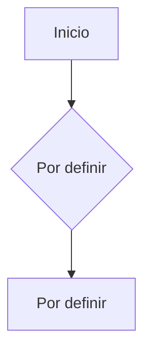

# Flujo de Navegación Principal

## Descripción
Diagrama del flujo de navegación principal de la app.

## Diagrama

---

> **Estado**: PENDIENTE — Completar cuando se defina la estructura de navegación.
