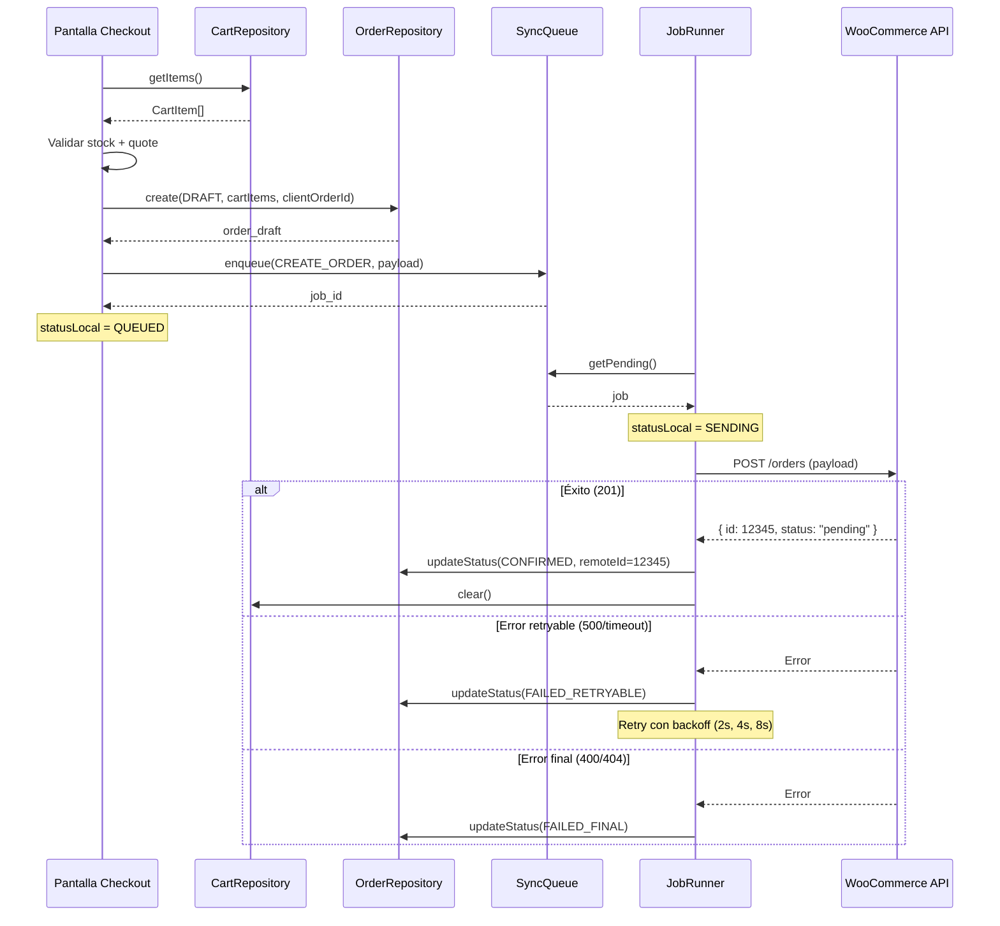

# Contrato de Creación de Órdenes

## Descripción

Este documento define el contrato exacto para crear órdenes en WooCommerce desde la app móvil. Especifica el payload que construye la app, las validaciones pre-envío, y la respuesta esperada.

**Endpoint**: `POST /wp-json/wc/v3/orders`
**Fuente**: `API_Reference_WooCommerce.pdf` + [modelo-order-draft.md](../03_architecture/modelo-order-draft.md)

---

## 1. Campos del Payload

### Campos Confirmados en PDF

| Campo | Tipo | Requerido | Origen en la App | Descripción |
|-------|------|-----------|------------------|-------------|
| `customer_id` | `number` | Sí | `SecureStorage.getUserId()` | ID del cliente autenticado en WooCommerce |
| `payment_method` | `string` | Sí | Configuración / selección usuario | Slug del método de pago (ej: `"bacs"`) |
| `payment_method_title` | `string` | Sí | Configuración / selección usuario | Nombre visible (ej: `"Transferencia bancaria"`) |
| `set_paid` | `boolean` | Sí | Siempre `false` en MVP | El pago se maneja externamente |
| `line_items` | `array` | Sí | `CartRepository.getItems()` | Productos del pedido |
| `line_items[].product_id` | `number` | Sí | `CartItem.productId` | ID del producto en WooCommerce |
| `line_items[].quantity` | `number` | Sí | `CartItem.quantity` | Cantidad solicitada |

### Campos Adicionales de la App (NO en PDF, estándar WooCommerce)

| Campo | Tipo | Requerido | Origen en la App | Descripción |
|-------|------|-----------|------------------|-------------|
| `billing` | `object` | Recomendado | `GET /customers/{id}` response | Datos de facturación del cliente |
| `shipping` | `object` | Recomendado | `GET /customers/{id}` response | Datos de envío del cliente |
| `meta_data` | `array` | Sí (para app) | Generado por la app | Metadata para idempotencia |

> **Nota**: `billing`, `shipping` y `meta_data` no aparecen en el ejemplo del PDF pero son campos estándar de la API WooCommerce v3. Se usan en la app para completar la orden y garantizar idempotencia.

---

## 2. Estructura de `billing` y `shipping`

Datos obtenidos del perfil del cliente (`GET /customers/{id}`).

```json
{
  "billing": {
    "first_name": "Juan",
    "last_name": "Pérez",
    "email": "juan@ejemplo.com",
    "phone": "555-1234",
    "address_1": "Calle Principal 123",
    "city": "Ciudad",
    "state": "Estado",
    "postcode": "12345",
    "country": "MX"
  },
  "shipping": {
    "first_name": "Juan",
    "last_name": "Pérez",
    "address_1": "Calle Principal 123",
    "city": "Ciudad",
    "state": "Estado",
    "postcode": "12345",
    "country": "MX"
  }
}
```

### Regla MVP

En MVP, `billing` y `shipping` pueden ser idénticos (misma dirección). Los datos se obtienen del perfil del cliente y se pre-llenan automáticamente.

---

## 3. Estructura de `meta_data` (Idempotencia)

```json
{
  "meta_data": [
    {
      "key": "client_order_id",
      "value": "a1b2c3d4-e5f6-7890-abcd-ef1234567890"
    },
    {
      "key": "app_version",
      "value": "1.0.0"
    }
  ]
}
```

| Key | Valor | Propósito |
|-----|-------|-----------|
| `client_order_id` | UUID v4 generado ANTES de encolar | Idempotencia y deduplicación. Ver [idempotencia.md](../03_architecture/idempotencia.md) |
| `app_version` | Versión de la app | Trazabilidad |

> **Regla**: `client_order_id` se genera UNA vez al crear el `order_draft` y NUNCA cambia.

---

## 4. Payload Completo de Ejemplo

```json
{
  "customer_id": 1680,
  "payment_method": "bacs",
  "payment_method_title": "Transferencia bancaria",
  "set_paid": false,
  "billing": {
    "first_name": "Juan",
    "last_name": "Pérez",
    "email": "juan@ejemplo.com",
    "phone": "555-1234",
    "address_1": "Calle Principal 123",
    "city": "Ciudad",
    "state": "Estado",
    "postcode": "12345",
    "country": "MX"
  },
  "shipping": {
    "first_name": "Juan",
    "last_name": "Pérez",
    "address_1": "Calle Principal 123",
    "city": "Ciudad",
    "state": "Estado",
    "postcode": "12345",
    "country": "MX"
  },
  "line_items": [
    {
      "product_id": 4993,
      "quantity": 2
    },
    {
      "product_id": 5001,
      "quantity": 1
    }
  ],
  "meta_data": [
    {
      "key": "client_order_id",
      "value": "a1b2c3d4-e5f6-7890-abcd-ef1234567890"
    },
    {
      "key": "app_version",
      "value": "1.0.0"
    }
  ]
}
```

---

## 5. Mapeo: CartItem[] Local → line_items[] WooCommerce

```
CartRepository.getItems() → CartItem[]

CartItem {                    line_items[] {
  productId  ──────────────→    product_id
  quantity   ──────────────→    quantity
  priceSnapshot (NO se envía)   // WooCommerce usa su precio actual
}
```

### Regla

- **NO se envía precio** en `line_items`. WooCommerce calcula el precio actual del producto.
- `priceSnapshot` se usa localmente para mostrar el subtotal estimado al usuario, pero el precio final lo determina WooCommerce.

---

## 6. Validaciones Pre-Envío

Antes de encolar el `CREATE_ORDER` en `sync_queue`, la app DEBE validar:

| # | Validación | Error si falla | Referencia |
|---|------------|----------------|------------|
| 1 | Carrito no vacío | `ERR_VALIDATION` | UI |
| 2 | Usuario autenticado (`customer_id` disponible) | `ERR_AUTH_EXPIRED` | `SecureStorage.hasSession()` |
| 3 | Conectividad disponible | `ERR_NETWORK` | `useNetworkStatus` |
| 4 | Stock disponible (hard stop) | `ERR_STOCK_UNAVAILABLE` | [flujo-checkout.md](../03_architecture/flujo-checkout.md) paso 2 |
| 5 | Quote calculado (subtotal + envío) | `ERR_QUOTE_FAILED` | [flujo-checkout.md](../03_architecture/flujo-checkout.md) paso 3 |
| 6 | No hay checkout activo (multi-submit block) | Ignorar tap | UI + lógica |

---

## 7. Response Esperado

### Éxito (HTTP 201)

```json
{
  "id": 12345,
  "status": "pending",
  "customer_id": 1680,
  "total": "300.00",
  "subtotal": "300.00",
  "discount_total": "0.00",
  "shipping_total": "0.00",
  "payment_method": "bacs",
  "date_created": "2026-03-04T10:30:00",
  "line_items": [
    {
      "product_id": 4993,
      "quantity": 2,
      "subtotal": "300.00",
      "total": "300.00"
    }
  ],
  "meta_data": [
    {
      "key": "client_order_id",
      "value": "a1b2c3d4-e5f6-7890-abcd-ef1234567890"
    }
  ]
}
```

### Campos Relevantes del Response

| Campo | Uso en la App |
|-------|---------------|
| `id` | Se guarda como `remoteId` en `OrderRepository.updateStatus()` |
| `status` | Se guarda como `statusRemote` |
| `total` | Se actualiza en el registro local (WooCommerce puede recalcular) |
| `meta_data[client_order_id]` | Confirmación de idempotencia |

### Errores Posibles

| HTTP Status | Significado | Acción App |
|-------------|-------------|------------|
| 400 | Payload inválido | `FAILED_FINAL` — mostrar error al usuario |
| 401 | Token expirado | `ERR_AUTH_EXPIRED` — redirigir a login |
| 404 | Producto no encontrado | `FAILED_FINAL` — producto ya no existe |
| 500 | Error del servidor | `FAILED_RETRYABLE` — retry con backoff |
| Timeout | Sin respuesta | `FAILED_RETRYABLE` — verificar dedup antes de retry |

---

## 8. Flujo Completo



---

## 9. Consistencia con Documentación Existente

| Documento | Validación |
|-----------|------------|
| [modelo-order-draft.md](../03_architecture/modelo-order-draft.md) sección 5 | Payload consistente (customer_id, billing, shipping, line_items, meta_data) |
| [flujo-checkout.md](../03_architecture/flujo-checkout.md) | Pasos de validación alineados |
| [idempotencia.md](../03_architecture/idempotencia.md) | `client_order_id` en meta_data confirmado |
| [estados-orden.md](../03_architecture/estados-orden.md) | Transiciones DRAFT→QUEUED→SENDING→CONFIRMED/FAILED |

---

> Fuente: `API_Reference_WooCommerce.pdf`, `planning/03_architecture/modelo-order-draft.md`
> HUs Relacionadas: HU-FUNC-CHK-001, HU-TECH-CHK-001, HU-NF-CHK-001
> Última actualización: 2026-03-04
