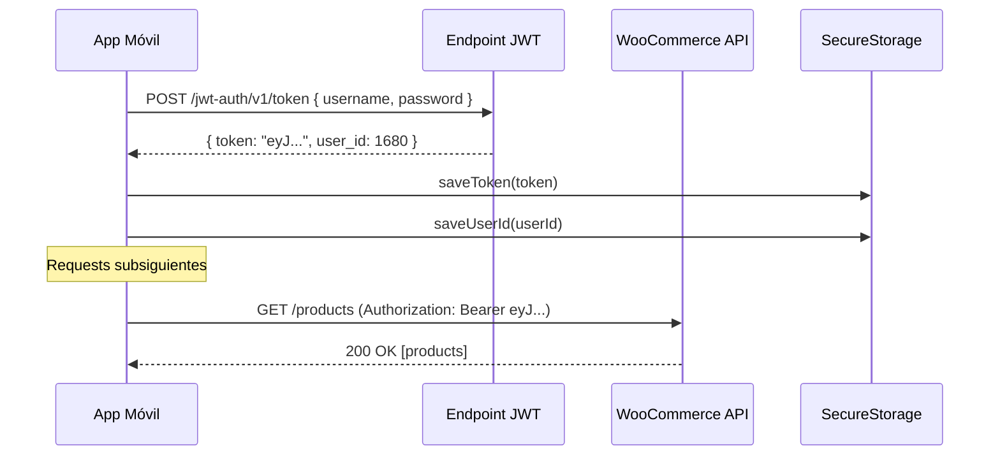

# Política de Seguridad API

## Descripción

Este documento define las políticas de seguridad para el consumo de la API WooCommerce REST v3 desde la app móvil. Establece reglas de manejo de credenciales, almacenamiento seguro y política de no exposición.

---

## 1. Credenciales WooCommerce (Consumer Key / Consumer Secret)

### Regla Principal

> **Las credenciales WooCommerce (`ck_xxxxx` / `cs_xxxxx`) NUNCA deben aparecer en código fuente, documentación versionada, ni en la app móvil.**

### Uso Permitido

| Contexto | Permitido | Notas |
|----------|:---------:|-------|
| Postman / herramientas de prueba | Sí | Solo en entorno de desarrollo local |
| Variables de entorno locales (.env) | Sí | `.env` incluido en `.gitignore` |
| Código fuente | **NO** | Prohibido hardcodear |
| Documentación versionada (planning/) | **NO** | No incluir claves reales |
| App móvil compilada | **NO** | La app usa JWT, no consumer keys |
| CI/CD secrets | Sí | Solo para tests automatizados |

### Justificación

Las consumer keys de WooCommerce otorgan acceso administrativo a la tienda. Si se exponen en el código de la app móvil, cualquier usuario podría extraerlas y acceder a datos de todos los clientes y órdenes.

---

## 2. Autenticación de la App Móvil

### Modelo de Autenticación

La app móvil **NO usa consumer keys directamente**. En su lugar:

```
Usuario → Login (username + password) → JWT Token → Acceso a API
```

### Flujo



### Interceptor JWT

El `HttpClient` (`src/infra/http/httpClient.ts`) inyecta automáticamente el token JWT en cada request:

```
Authorization: Bearer {token}
```

- El token se obtiene de `SecureStorage.getToken()` antes de cada request
- Si el token ha expirado (HTTP 401), se clasifica como `ERR_AUTH_EXPIRED` y se redirige al login
- La contraseña NUNCA se almacena — solo se usa en el momento del login

---

## 3. Almacenamiento Seguro

### Datos Cifrados (expo-secure-store)

| Dato | Almacenamiento | Cifrado |
|------|----------------|---------|
| JWT Token | `expo-secure-store` | iOS Keychain / Android EncryptedSharedPreferences |
| User ID | `expo-secure-store` | iOS Keychain / Android EncryptedSharedPreferences |

### Datos NO Cifrados (SQLite)

| Dato | Almacenamiento | Justificación |
|------|----------------|---------------|
| Productos | SQLite | Datos públicos del catálogo |
| Cart items | SQLite | Datos locales del usuario |
| Orders | SQLite | Historial local (sin datos de pago) |

### Datos NUNCA Almacenados

| Dato | Razón |
|------|-------|
| Contraseña del usuario | Solo se usa en el momento del login |
| Datos de tarjeta/pago | El pago se maneja externamente por WooCommerce |
| Consumer Key / Secret | Solo para Postman / entorno de desarrollo |
| Información bancaria | Fuera del scope de la app |

Referencia completa: [politica-datos-sensibles.md](../03_architecture/politica-datos-sensibles.md)

---

## 4. Política de No Exposición

### Código Fuente

- `.gitignore` incluye: `.env`, `.env.local`, `.env.production`, `credentials.json`, `*.key`
- No hardcodear URLs de producción en código fuente
- La URL base de la API se configura en runtime (`Config.api.baseUrl`)

### Variables de Entorno

```
# .env (NO versionado — solo en desarrollo local)
API_BASE_URL=https://{dominio}/wp-json/wc/v3
WC_CONSUMER_KEY=ck_xxxxx    # Solo para Postman
WC_CONSUMER_SECRET=cs_xxxxx  # Solo para Postman
```

### Documentación

- Los ejemplos en `planning/` usan placeholder `{credentials}` o `{dominio}`
- Ningún documento versionado contiene claves reales
- Los ejemplos de response usan datos ficticios

---

## 5. Capa Intermedia (Consideración Futura)

### Escenario Actual (MVP)

```
App Móvil → JWT → WooCommerce API directamente
```

En MVP, la app consume WooCommerce directamente usando JWT del usuario. Esto es aceptable porque:
- Cada usuario solo accede a sus propios datos
- El JWT limita el scope de acceso
- No se exponen consumer keys

### Escenario Futuro (Post-MVP)

Si se requiere seguridad adicional o lógica de negocio server-side:

```
App Móvil → JWT → Backend Proxy → Consumer Keys → WooCommerce API
```

Un backend proxy permitiría:
- Ocultar completamente las consumer keys
- Agregar validaciones server-side
- Rate limiting por usuario
- Caché server-side del catálogo
- Logging centralizado

> **Decisión**: En MVP se consume WooCommerce directamente. La necesidad de un proxy se evaluará en Phase 2 basándose en los datos de telemetría y los requisitos de seguridad del cliente.

---

## 6. Manejo de Errores de Autenticación

| Error | Código App | Acción |
|-------|------------|--------|
| Token expirado (401) | `ERR_AUTH_EXPIRED` | Limpiar sesión → Redirigir a login |
| Credenciales inválidas (401 en login) | `ERR_AUTH_INVALID` | Mostrar mensaje de error |
| Sin permisos (403) | `ERR_AUTH_FORBIDDEN` | Mostrar mensaje + contactar soporte |

### Limpieza en Logout

Secuencia completa de limpieza (por [politica-datos-sensibles.md](../03_architecture/politica-datos-sensibles.md)):

1. Borrar token JWT de SecureStore
2. Borrar `userId` de SecureStore
3. Borrar orders con status `DRAFT` de SQLite
4. Limpiar `cart_items` de SQLite
5. Limpiar `sync_queue` jobs pendientes
6. Limpiar `telemetry_events` no enviados (opcional)

---

## 7. Checklist de Seguridad

- [ ] Consumer keys NO aparecen en ningún archivo versionado
- [ ] `.env` está en `.gitignore`
- [ ] Token JWT se almacena en `expo-secure-store`
- [ ] Contraseña NUNCA se persiste
- [ ] HttpClient inyecta Bearer token automáticamente
- [ ] Errores 401 limpian sesión y redirigen a login
- [ ] Logout ejecuta limpieza completa
- [ ] URLs de producción NO están hardcodeadas
- [ ] Datos de pago NUNCA se almacenan en la app

---

> HUs Relacionadas: HU-NF-SEC-001, HU-TECH-AUTH-001, HU-NF-FOUND-001
> Última actualización: 2026-03-04
